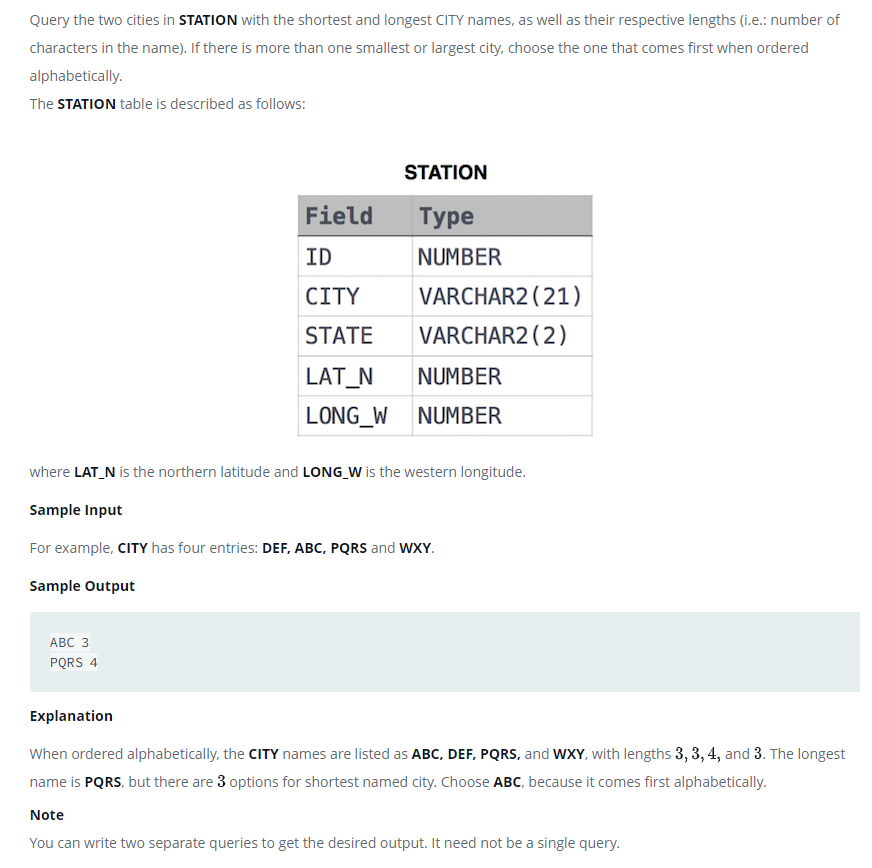

### Станция наблюдения за погодой 5 [Weather Observation Station 5]



#### eng:
Query the two cities in STATION with the shortest and longest CITY names, as well as their respective lengths 
(i.e.: number of characters in the name). If there is more than one smallest or largest city, choose the one that 
comes first when ordered alphabetically.
The STATION table is described as follows:

where LAT_N is the northern latitude and LONG_W is the western longitude.

Sample Input

For example, CITY has four entries: DEF, ABC, PQRS and WXY.

Explanation
When ordered alphabetically, the CITY names are listed as ABC, DEF, PQRS, and WXY, with lengths  and . The longest name
is PQRS, but there are  options for shortest named city. Choose ABC, because it comes first alphabetically.

Note
You can write two separate queries to get the desired output. It need not be a single query.

#### рус:
Запросите два города в STATION с самыми короткими и самыми длинными названиями CITY, а также их соответствующей длиной
(т.е. количеством символов в названии). Если существует более одного самого маленького или самого большого города, 
выберите тот, который идет первым в алфавитном порядке.
Таблица STATION описывается следующим образом:

где LAT_N — северная широта, а LONG_W — западная долгота.

Образец ввода
Например, CITY имеет четыре записи: DEF, ABC, PQRS и WXY.

Объяснение
При упорядочении в алфавитном порядке названия ГОРОДА перечислены как ABC, DEF, PQRS и WXY с длинами и. Самое длинное
название — PQRS, но есть варианты для города с самым коротким названием. Выберите ABC, потому что он стоит первым в 
алфавитном порядке.

Запись
Вы можете написать два отдельных запроса, чтобы получить желаемый результат. Это не обязательно должен быть один запрос.

#### код с коментариями:
```sql
SELECT                                      /* выбрать данные */
    city,                                   /* столбец */
    LENGTH(city) AS city_length             /* столбец длины с названием */
FROM STATION                                /* из таблицы */
WHERE LENGTH(city) = (SELECT                /* где условие1 = встроенному запросу выбора данных */
                        MIN(LENGTH(city))   /* столбец минимальной длинны названий городов */
                        FROM STATION)       /* из таблицы */
    OR                                      /* или */
      LENGTH(city) = (SELECT                /* условие 2 = встроенному запросу выбора данныех*/
                        MAX(LENGTH(city))   /* столбец максимальной длинны названий городов */
                        FROM STATION)       /* из таблицы */
ORDER BY                                    /* отсортировать */
    length(city)desc,                       /* по длинне названий в обратном порядке */
    city ASC                                /* затем по названию городов кодировки аски */
limit 2;                                    /* не более 2 строк */
```

#### код для hackerrank:
```sql
SELECT 
    city, 
    LENGTH(city) AS city_length 
FROM STATION 
WHERE LENGTH(city) = (SELECT 
                        MIN(LENGTH(city)) 
                        FROM STATION) 
                    or LENGTH(city) = (SELECT 
                                        MAX(LENGTH(city)) 
                                        FROM STATION) 
ORDER BY length(city)desc,city ASC 
limit 2;
```


#### На [главную](https://github.com/BEPb/hackerrank_sql#readme)

---