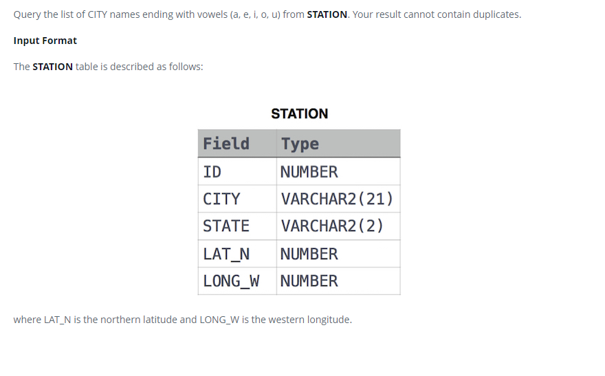

### Станция наблюдения за погодой 7 [Weather Observation Station 7]



#### eng:
Query the list of CITY names ending with vowels (a, e, i, o, u) from STATION. Your result cannot contain duplicates.
Input Format
The STATION table is described as follows:
where LAT_N is the northern latitude and LONG_W is the western longitude.


#### рус:
Запросите список названий ГОРОДА, оканчивающихся на гласные (a, e, i, o, u), из STATION. Ваш результат не может содержать дубликатов.
Формат ввода
Таблица STATION описывается следующим образом:
где LAT_N — северная широта, а LONG_W — западная долгота.


#### код с коментариями:
```sql
SELECT                  /* выбрать данные */
    DISTINCT CITY       /* уникальные значения столбца */
FROM STATION            /* из таблицы */
WHERE                   /* где */
    CITY LIKE '%a' OR   /* значение столбца содержит симовл или */
    CITY LIKE '%e' OR   /* значение столбца содержит симовл или */
    CITY LIKE '%i' OR   /* значение столбца содержит симовл или */
    CITY LIKE '%o' OR   /* значение столбца содержит симовл или */
    CITY LIKE '%u' ;    /* значение столбца содержит симовл */
```

#### код для hackerrank:
```sql
SELECT 
    DISTINCT CITY 
FROM STATION 
WHERE 
    CITY LIKE '%a' OR 
    CITY LIKE '%e' OR 
    CITY LIKE '%i' OR 
    CITY LIKE '%o' OR 
    CITY LIKE '%u' ;
```

#### На [главную](https://github.com/BEPb/hackerrank_sql#readme)

---