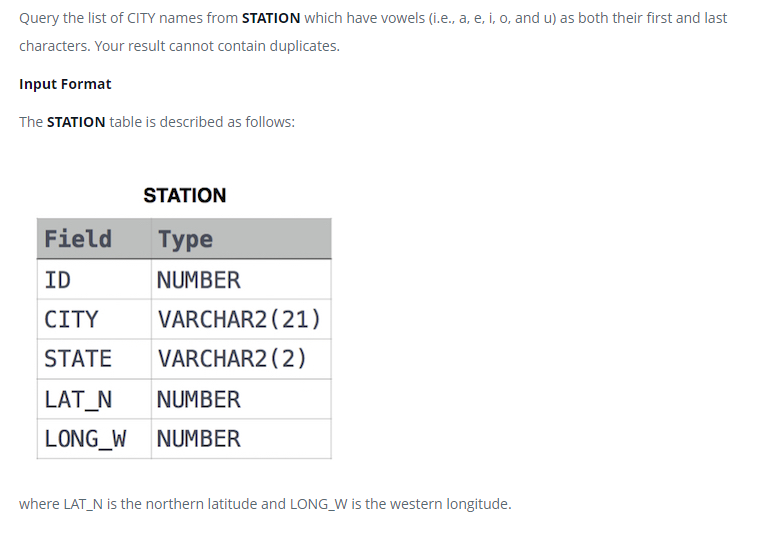

### Станция наблюдения за погодой 8 - [Weather Observation Station 8]



#### eng:
Query the list of CITY names from STATION which have vowels (i.e., a, e, i, o, and u) as both their first and last characters. Your result cannot contain duplicates.

input format
The STATION table is described as follows:
where LAT_N is the northern latitude and LONG_W is the western longitude.


#### рус:
Запросите список названий ГОРОДА из STATION, в которых гласные (т. е. a, e, i, o и u) стоят 
как в первом, так и в последнем символе. Ваш результат не может содержать дубликатов.

формат ввода
Таблица STATION описывается следующим образом:
где LAT_N — северная широта, а LONG_W — западная долгота.


#### код с коментариями:
```sql
SELECT                  /* выбрать данные */
    DISTINCT CITY       /* уникальные значения столбца */
FROM STATION            /* из таблицы */
WHERE                   /* где */
    -- условие №1 состоящие из другого набора условий
    (CITY LIKE 'a%' OR  /* условие или */
     CITY LIKE 'e%' OR  /* условие или */
     CITY LIKE 'i%' OR  /* условие или */
     CITY LIKE 'o%' OR  /* условие или */
     CITY LIKE 'u%')    /* условие */
     AND
     -- условие №2 состоящие из другого набора условий
     (CITY LIKE '%a' OR  /* условие или */
      CITY LIKE '%e' OR  /* условие или */
      CITY LIKE '%i' OR  /* условие или */
      CITY LIKE '%o' OR  /* условие или */
      CITY LIKE '%u');   /* условие*/
```

#### код для hackerrank:
```sql
SELECT 
    DISTINCT CITY 
FROM STATION 
WHERE 
    (CITY LIKE 'a%' OR 
     CITY LIKE 'e%' OR 
     CITY LIKE 'i%' OR 
     CITY LIKE 'o%' OR 
     CITY LIKE 'u%') 
     AND 
     (CITY LIKE '%a' OR 
      CITY LIKE '%e' OR 
      CITY LIKE '%i' OR 
      CITY LIKE '%o' OR 
      CITY LIKE '%u');
```
или:
```sql
SELECT 
    DISTINCT CITY 
FROM STATION 
WHERE 
    LOWER(left(city,1)) in ("a","o","e","i","u") 
    AND 
    LOWER(right(city,1)) in ("a","o","e","i","u");    
```
или:
```SQL
SELECT 
    DISTINCT CITY 
FROM STATION 
WHERE 
    substr(lower(city),-1,1) in ('a', 'e', 'i', 'o', 'u') 
    AND 
    substr(lower(city),1,1) in ('a', 'e', 'i', 'o', 'u') ;
```
#### На [главную](https://github.com/BEPb/hackerrank_sql#readme)

---