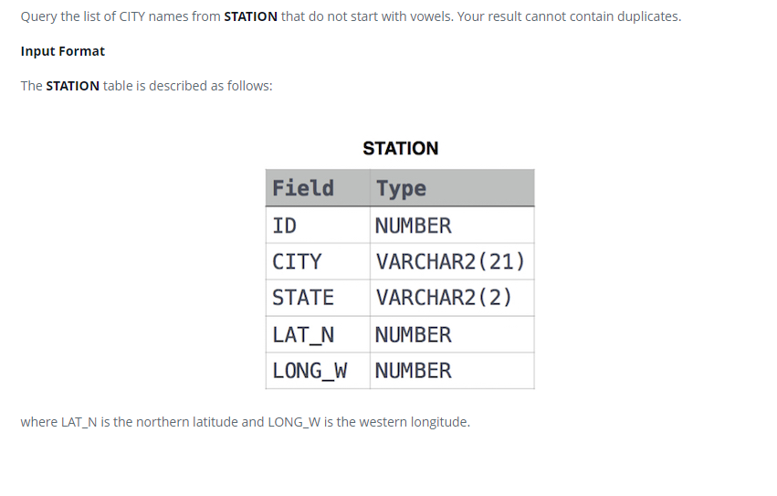

### Станция наблюдения за погодой 9 - [Weather Observation Station 9]



#### eng:
Query the list of CITY names from STATION that do not start with vowels. Your result cannot contain duplicates.

Input Format

The STATION table is described as follows:
where LAT_N is the northern latitude and LONG_W is the western longitude.


#### рус:
Запросите список названий ГОРОДА из STATION, которые не начинаются с гласных. 
Ваш результат не может содержать дубликатов.

Формат ввода

Таблица STATION описывается следующим образом:
где LAT_N — северная широта, а LONG_W — западная долгота.


#### код с коментариями:
```sql
SELECT                  /* выбрать данные */
    DISTINCT CITY       /* уникальные значения столбца */
FROM STATION            /* из таблицы */
WHERE                   /* где */
    LEFT(CITY, 1) not IN ('A', 'I', 'O', 'U', 'E')
```

#### код для hackerrank:
```sql
SELECT 
    DISTINCT CITY 
FROM STATION 
WHERE 
    LEFT(CITY, 1) not IN ('A', 'I', 'O', 'U', 'E')
```


#### На [главную](https://github.com/BEPb/hackerrank_sql#readme)

---