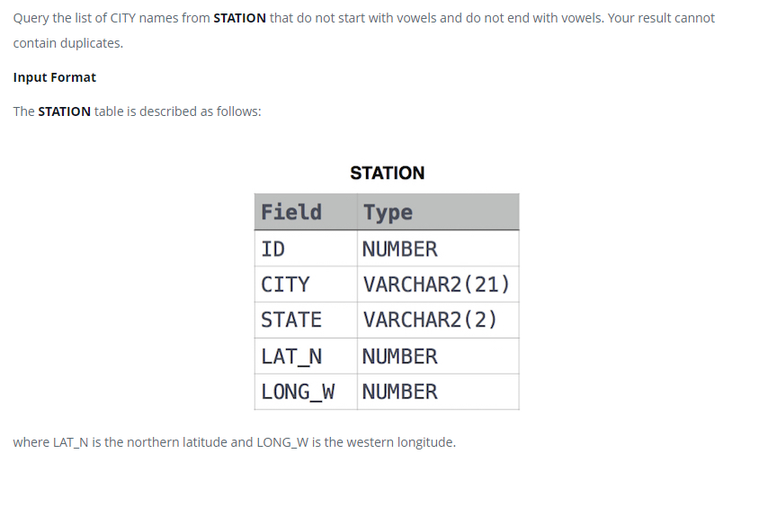

### Станция наблюдения за погодой 12 - [Weather Observation Station 12]



#### eng:
Query the list of CITY names from STATION that do not start with vowels and do not end with vowels. Your result cannot contain duplicates.

Input Format

The STATION table is described as follows:
where LAT_N is the northern latitude and LONG_W is the western longitude.


#### рус:
Запросите список названий ГОРОДА из STATION, которые не начинаются с гласных и 
не заканчиваются на гласные. Ваш результат не может содержать дубликатов.

Формат ввода

Таблица STATION описывается следующим образом:
где LAT_N — северная широта, а LONG_W — западная долгота.


#### код с коментариями:
```sql
SELECT                          /* выбрать данные */
    DISTINCT CITY               /* уникальные значения столбца */
FROM STATION                    /* из таблицы */
WHERE                           /* где */
    -- условие №1 состоящие из других условий
    (CITY not LIKE 'a%' and     /* условие и */
     CITY not LIKE 'e%' and     /* условие и */
     CITY not LIKE 'i%' and     /* условие и */
     CITY not LIKE 'o%' and     /* условие и */
     CITY not LIKE 'u%')        /* условие */
     AND                         /* и */
     -- условие №2 состоящие из других условий
     (CITY not LIKE '%a' and    /* условие и */
      CITY not LIKE '%e' and    /* условие и */
      CITY not LIKE '%i' and    /* условие и */
      CITY not LIKE '%o' and    /* условие и */
      CITY not LIKE '%u')       /* условие*/
```

#### код для hackerrank:
```SQL
SELECT 
    DISTINCT CITY 
FROM STATION 
WHERE 
    (CITY not LIKE 'a%' and 
     CITY not LIKE 'e%' and 
     CITY not LIKE 'i%' and 
     CITY not LIKE 'o%' and 
     CITY not LIKE 'u%') 
     AND
     (CITY not LIKE '%a' and 
      CITY not LIKE '%e' and 
      CITY not LIKE '%i' and 
      CITY not LIKE '%o' and 
      CITY not LIKE '%u')
```

```sql
SELECT 
    DISTINCT CITY 
FROM STATION 
WHERE 
    substr(lower(city),1,1) not in ('a', 'e', 'i', 'o', 'u') 
    AND
    substr(lower(city),-1,1) not in ('a', 'e', 'i', 'o', 'u');
```

```sql
SELECT 
    DISTINCT CITY 
FROM STATION 
WHERE 
    CITY REGEXP '^[^AEIOUaeiou].*[^AEIOUaeiou]$';
```

#### На [главную](https://github.com/BEPb/hackerrank_sql#readme)

---