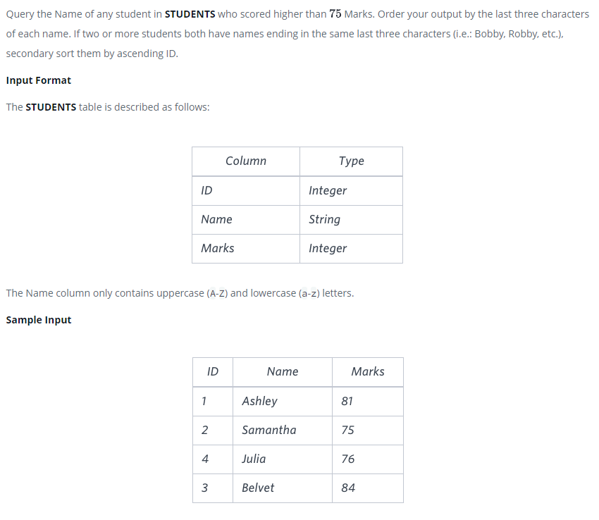

### Выше 75 баллов - [Higher Than 75 Marks]



#### eng:
Query the Name of any student in STUDENTS who scored higher than  Marks. Order your output by the last three characters of each name. If two or more students both have names ending in the same last three characters (i.e.: Bobby, Robby, etc.), secondary sort them by ascending ID.

Input Format

The STUDENTS table is described as follows:The Name column only contains uppercase (A-Z) and lowercase (a-z) letters.


#### рус:
Запросите имя любого учащегося в STUDENTS, который набрал больше баллов, чем Marks.
Упорядочить выходные данные по последним трем символам каждого имени. 
Если два или более учащихся имеют имена, оканчивающиеся на одни и те же последние три символа (например, Бобби, Робби и т. д.), вторичная сортировка их по возрастанию идентификатора.

Формат ввода
Таблица STUDENTS описывается следующим образом: Столбец Name содержит только прописные (A-Z) и строчные (a-z) буквы.


#### код с коментариями:
```sql
SELECT NAME                 /* выбрать данные столбца */
FROM STUDENTS               /* из таблицы */
WHERE MARKS>75              /* где условие */
ORDER BY                    /* отсортировать по */
    RIGHT(NAME,3),          /* справа 3-й последний символ */
    ID                      /* далее по номеру записи */
```

#### код для hackerrank:
```sql
SELECT NAME 
FROM STUDENTS 
WHERE MARKS>75 
ORDER BY 
    RIGHT(NAME,3),
    ID
```


#### На [главную](https://github.com/BEPb/hackerrank_sql#readme)

---