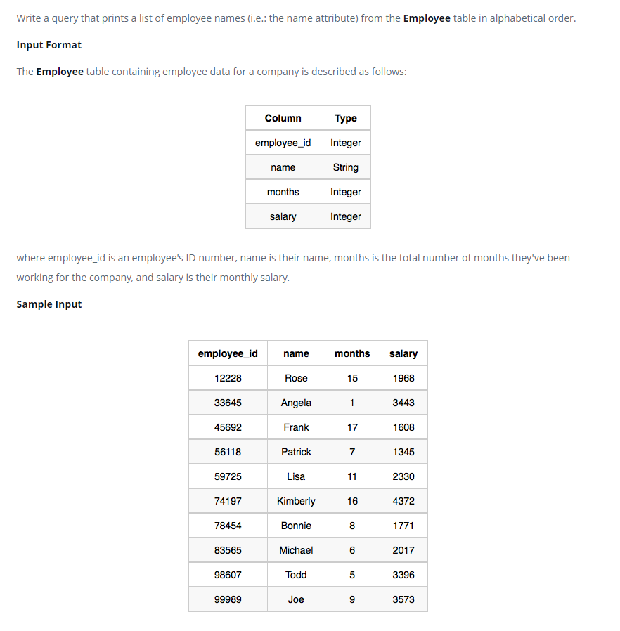

### Имена сотрудников - [Employee Names]



#### eng:
Write a query that prints a list of employee names (i.e.: the name attribute) from the Employee table in alphabetical order.

Input Format
The Employee table containing employee data for a company is described as follows:
where employee_id is an employee's ID number, name is their name, months is the total number of months they've been working for the company, and salary is their monthly salary.


#### рус:
Напишите запрос, который выводит список имен сотрудников (т.е. атрибут name) 
из таблицы Employee в алфавитном порядке.

Формат ввода
Таблица Employee, содержащая данные о сотрудниках компании, описывается следующим образом:
где employee_id — идентификационный номер сотрудника, name — его имя, month — общее количество месяцев, в течение которых он проработал в компании, а зарплата — его месячная зарплата.


#### код с коментариями:
```sql
SELECT NAME     /* выбрать данные столбца */
FROM Employee   /* из таблицы */
ORDER BY NAME   /* отсортировать по имени */
```

#### код для hackerrank:
```sql
SELECT NAME
FROM Employee
ORDER BY NAME
```


#### На [главную](https://github.com/BEPb/hackerrank_sql#readme)

---