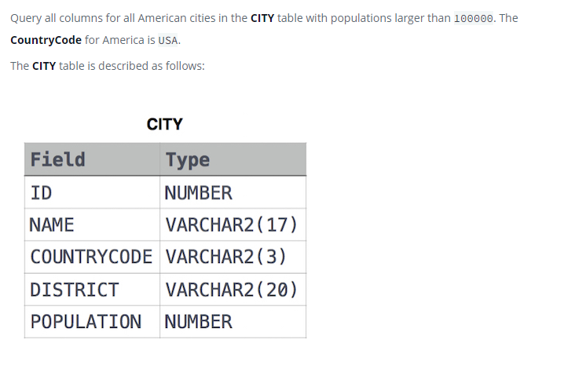

#### eng:

Query the NAME field for all American cities in the CITY table with populations larger than 120000. The CountryCode for America is USA.
The CITY table is described as follows:


#### рус:

Запросите поле NAME для всех американских городов в таблице CITY с населением более 120 000 человек. CountryCode для Америки — USA.
Таблица CITY описывается следующим образом:

#### код с пояснениями:
```sql
SELECT                          /* выбрать данные */
    NAME                        /* столбец */
FROM                            /* из */
    CITY                        /* таблицы */
WHERE                           /* где */
    POPULATION > 120000 AND     /* условие 1 и */
    COUNTRYCODE = 'USA'         /* условие 2 */
```

#### код для hackerrank
```sql
SELECT NAME
FROM CITY
WHERE POPULATION > 120000 AND COUNTRYCODE = 'USA'
```


#### На [главную](https://github.com/BEPb/hackerrank_sql#readme)

---