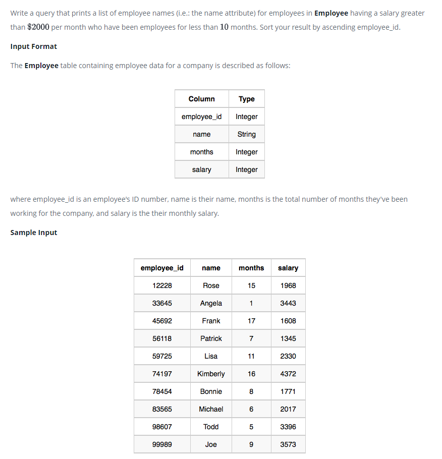

### Заработная плата сотрудников - [Employee Salaries]



#### eng:
Write a query that prints a list of employee names (i.e.: the name attribute) for employees in Employee having a salary greater than  per month who have been employees for less than  months. Sort your result by ascending employee_id.

Input Format
The Employee table containing employee data for a company is described as follows:
where employee_id is an employee's ID number, name is their name, months is the total number of months they've been working for the company, and salary is the their monthly salary.


#### рус:
Напишите запрос, который выводит список имен сотрудников (т. е. атрибут name) для сотрудников
в Employee с зарплатой больше 2000, чем в месяц, которые проработали меньше 10 месяцев. 
Отсортируйте результат по возрастанию employee_id.

Формат ввода

Таблица Employee, содержащая данные о сотрудниках компании, описывается следующим образом:
где employee_id — это идентификационный номер сотрудника, name — это его имя, months — это общее количество месяцев, в течение которых они работали в компании, а зарплата — это их месячная зарплата.


#### код с коментариями:
```sql
SELECT name             /* выбрать данные столбца */
FROM Employee           /* из таблицы */
WHERE                   /* где */
    salary> 2000 AND    /* условие и */
    months<10           /* условие
ORDER BY employee_id;   /* отсортировать по столбцу */
```

#### код для hackerrank:
```sql
SELECT name 
FROM Employee 
WHERE 
    salary> 2000 AND
     months<10 
ORDER BY employee_id;
```


#### На [главную](https://github.com/BEPb/hackerrank_sql#readme)

---