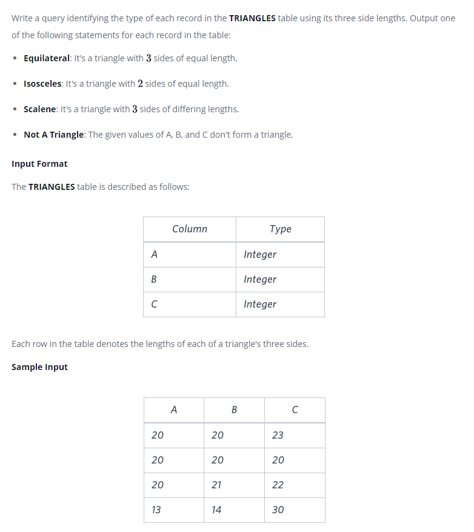

### Тип треугольника - [Type of Triangle]



#### eng:
Write a query identifying the type of each record in the TRIANGLES table using its three side lengths. Output one of the following statements for each record in the table:

Equilateral: It's a triangle with  sides of equal length.
Isosceles: It's a triangle with  sides of equal length.
Scalene: It's a triangle with  sides of differing lengths.
Not A Triangle: The given values of A, B, and C don't form a triangle.
Input Format

The TRIANGLES table is described as follows:
Each row in the table denotes the lengths of each of a triangle's three sides.

Sample Input


#### рус:
Напишите запрос, определяющий тип каждой записи в таблице TRIANGLES, используя три длины 
ее сторон. Выведите одно из следующих утверждений для каждой записи в таблице:

Равносторонний: Это треугольник со сторонами одинаковой длины.
Равнобедренный: это треугольник со сторонами одинаковой длины.
Scalene: Это треугольник со сторонами разной длины.
Не треугольник: заданные значения A, B и C не образуют треугольник.
Формат ввода

Таблица TRIANGLES описывается следующим образом:
Каждая строка в таблице обозначает длины каждой из трех сторон треугольника.

Образец ввода


#### код с коментариями:
```sql
SELECT                                              /* выбрать данные */
    CASE                                            /* условный оператор */
        WHEN A+B<=C THEN 'Not A Triangle'           /* условие 1 - результат */
        WHEN A=B AND B=C and A=C THEN 'Equilateral' /* условие 2 - результат */
        WHEN A=B OR B=C OR C=A THEN 'Isosceles'     /* условие 3 - результат */
        ELSE 'Scalene'                              /* иначе - результат */
    END                                             /* конец условного оператора */
FROM TRIANGLES;                                     /* из таблицы */
```

#### код для hackerrank:
```sql
SELECT 
    CASE 
        WHEN A+B<=C THEN 'Not A Triangle' 
        WHEN A=B AND B=C and A=C THEN 'Equilateral' 
        WHEN A=B OR B=C OR C=A THEN 'Isosceles' 
        ELSE 'Scalene' 
    END 
FROM TRIANGLES;

```


#### На [главную](https://github.com/BEPb/hackerrank_sql#readme)

---