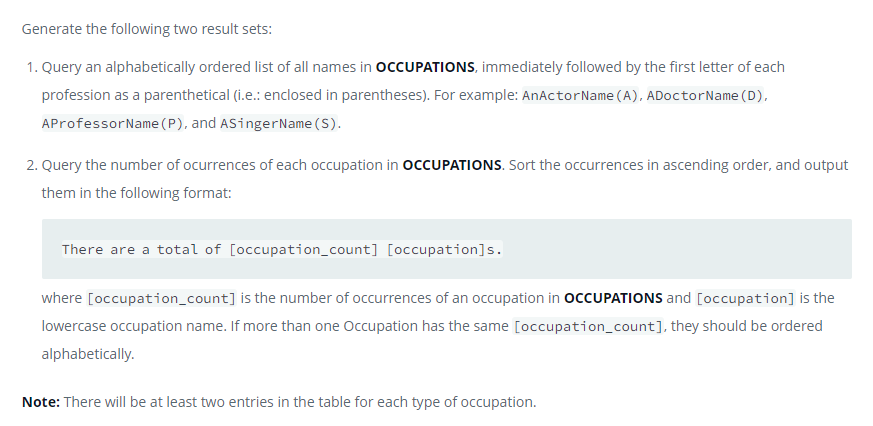

### ПОДУШКИ - [The PADS]



#### eng:
Generate the following two result sets:

Query an alphabetically ordered list of all names in OCCUPATIONS, immediately followed by the first letter of each profession as a parenthetical (i.e.: enclosed in parentheses). For example: AnActorName(A), ADoctorName(D), AProfessorName(P), and ASingerName(S).
Query the number of ocurrences of each occupation in OCCUPATIONS. Sort the occurrences in ascending order, and output them in the following format:

There are a total of [occupation_count] [occupation]s.
where [occupation_count] is the number of occurrences of an occupation in OCCUPATIONS and [occupation] is the lowercase occupation name. If more than one Occupation has the same [occupation_count], they should be ordered alphabetically.

Note: There will be at least two entries in the table for each type of occupation.


#### рус:
Сгенерируйте следующие два набора результатов:

Запросите упорядоченный по алфавиту список всех имен в ПРОФЕССИЯХ, сразу за которыми следует первая буква каждой 
профессии в скобках (т. е. заключенная в круглые скобки). Например: AnActorName(A), 
ADoctorName(D), AProfessorName(P) и ASingerName(S).
Запросите количество вхождений каждой профессии в OCCUPATIONS.
Отсортируйте вхождения в порядке возрастания и выведите их в следующем формате:

Всего существует [occupation_count] [оккупация].
где [occupation_count] — количество вхождений занятия в OCCUPATIONS, а [occupation] — название занятия в нижнем регистре. Если более чем одна профессия имеет один и тот же [occupation_count], они должны быть упорядочены в алфавитном порядке.

Примечание. В таблице будет не менее двух записей для каждого вида занятий.


#### код с коментариями:
```sql
-- первый запрос
SELECT                                                                  /* выбрать данные */
    CONCAT(name,'(',LEFT(occupation,1),')') AS Name                     /* столбец */
FROM OCCUPATIONS                                                        /* из таблицы */
ORDER BY name;                                                          /* отсортировать по столбцу */

-- второй запрос
SELECT                                                                  /* выбрать данные */
    CONCAT('There are a total of ',COUNT(*),' ',LOWER(occupation),'s.') /* столбец */
FROM OCCUPATIONS                                                        /* из таблицы */
GROUP BY occupation                                                     /* сгруппировать */
ORDER BY COUNT(*) ASC;                                                  /* отсортировать по количеству */
```

#### код для hackerrank:
```sql
SELECT                                                  
    CONCAT(name,'(',LEFT(occupation,1),')') AS Name
FROM OCCUPATIONS
ORDER BY name;

SELECT  
    CONCAT('There are a total of ',COUNT(*),' ',LOWER(occupation),'s.')
FROM OCCUPATIONS
GROUP BY occupation
ORDER BY COUNT(*) ASC;
```


#### На [главную](https://github.com/BEPb/hackerrank_sql#readme)

---