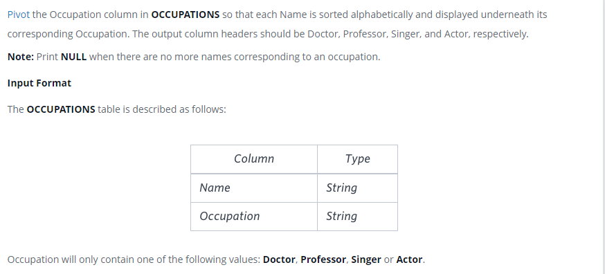

### Профессии - [Occupations]



#### eng:
Pivot the Occupation column in OCCUPATIONS so that each Name is sorted alphabetically  and displayed underneath its 
corresponding Occupation. The output column headers should be Doctor, Professor, Singer, and Actor, respectively.

Note: Print NULL when there are no more names corresponding to an occupation.

Input Format

The OCCUPATIONS table is described as follows:
Occupation will only contain one of the following values: Doctor, Professor, Singer or Actor.


#### рус:
Поверните столбец «Профессия» в «ОККУПАЦИИ», чтобы каждое имя было отсортировано в 
алфавитном порядке и отображалось под соответствующей профессией. 
Заголовки выходных столбцов должны быть «Доктор», «Профессор», «Певец» и «Актер» 
соответственно.

Примечание. Выведите NULL, если больше нет имен, соответствующих роду занятий.

Формат ввода

Таблица OCCUPATIONS описывается следующим образом:
Род занятий будет содержать только одно из следующих значений: Доктор, Профессор, Певец 
или Актер.


#### код с коментариями:
```sql
-- Итак нам нужно будет создать таблицу из 4-х столбцов доктор, профессор, певец, 
-- обобщенное табличное выражение 
WITH temp AS (                                  /* создать временную таблицу */
SELECT                                          /* выбрать данные */
    CASE                                        /* в случае */
        WHEN occupation='doctor' THEN name      /* когда занятие доктор имя внести в столбец доктор */
    END AS doctor,
    CASE                                        /* в случае */
        WHEN occupation='professor' THEN name   /* когда занятие профессор имя внести в столбец профессор */
    END AS professor,
    CASE                                        /* в случае */
        WHEN occupation='singer' THEN name      /* когда занятие певец имя внести в столбец певец */
    END AS singer, 
    CASE                                        /* в случае */
        WHEN occupation='actor' THEN name       /* когда занятие актер имя внести в столбец актер */
    END AS actor, 
    row_number() over                           /* нумерует строки, возвращаемые запросом */
    (partition by occupation                    /* разделить по занятию */
    ORDER BY name) as ran                       /* отсортировать по имени */
FROM occupations)                               /* из таблицы занятие */
SELECT                                          /* выбрать данные */
    min(doctor),                                /* выбрать минимальные данные столбца */
    min(professor),                             /* выбрать минимальные данные столбца */
    min(singer),                                /* выбрать минимальные данные столбца */
    min(actor)                                  /* выбрать минимальные данные столбца */
FROM temp                                       /* из временной таблицы */
GROUP BY ran                                    /* сгруппировать по столбцу номер по порядку */
```

#### код для hackerrank:
```sql
WITH temp AS (
SELECT 
    CASE 
        WHEN occupation='doctor' THEN name 
    END AS doctor,
    CASE 
        WHEN occupation='professor' THEN name 
    END AS professor,
    CASE 
        WHEN occupation='singer' THEN name 
    END AS singer,
    CASE 
        WHEN occupation='actor' THEN name 
    END AS actor, 
    row_number() over (partition by occupation ORDER BY name) as ran 
FROM occupations)
SELECT 
    min(doctor), 
    min(professor), 
    min(singer), 
    min(actor) 
FROM temp 
GROUP BY ran
```


#### На [главную](https://github.com/BEPb/hackerrank_sql#readme)

---