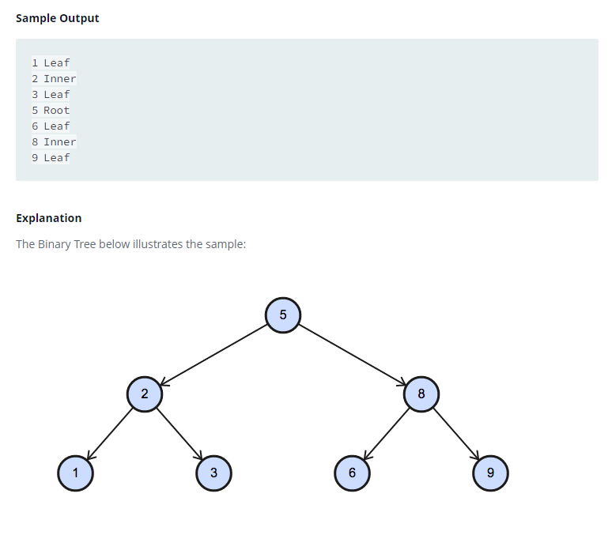

### 



#### eng:
You are given a table, BST,  containing two columns: N and P, where N represents the value of a node in Binary Tree, 
and P is the parent of N.

Write a query to find the  node type of Binary Tree ordered by the value of the node. Output one of the following 
for each node:

Root: If node is root node.
Leaf: If node is leaf node.
Inner: If node is neither root nor leaf node.


#### рус:
Вам дана таблица BST, содержащая два столбца: N и P, где N представляет значение узла в двоичном дереве, а P 
является родителем N.


Напишите запрос, чтобы найти тип узла двоичного дерева, упорядоченный по значению узла. Выведите одно из следующего 
для каждого узла:

Корень: если узел является корневым узлом.
Лист: если узел является листовым узлом.
Внутренний: если узел не является ни корневым, ни конечным узлом.


#### код с коментариями:
```sql
SELECT                                              /* выбрать данные */
    n ,                                             /* столбец номер */
    CASE                                            /* создадим новый столбец, в котором */
        WHEN p IS NULL THEN "Root"                  /* если значение ноль, то выводим значение "Root"*/
        WHEN n IN(SELECT p FROM bst) THEN "Inner"   /* если значение есть в столбце то значение "Inner" */
        ELSE "Leaf"                                 /* все остальные значение "Leaf" */
    END                                             /* закончить новый столбец */
FROM bst                                            /* из таблицы */
ORDER BY n;                                         /* отсортировать по номеру */
```

#### код для hackerrank:
```sql
SELECT 
    n , 
    CASE 
        WHEN p IS NULL THEN "Root" 
        WHEN n IN(SELECT p FROM bst) THEN "Inner" 
        ELSE "Leaf" 
    END 
FROM bst 
ORDER BY n;
```


#### На [главную](https://github.com/BEPb/hackerrank_sql#readme)

---