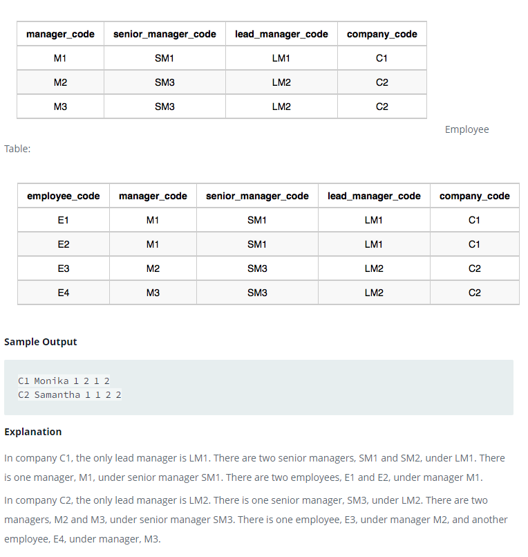

### 



#### eng:
Amber's conglomerate corporation just acquired some new companies. Each of the companies follows this hierarchy: 

Given the table schemas below,  write a query to print the company_code, founder name, total number of lead managers,
total number of senior managers,  total number of managers, and total number of employees. Order your output by 
ascending company_code.

Note:

The tables may contain duplicate records.
The company_code is string, so the  sorting should not be numeric. For example, if the company_codes are C_1, C_2, 
and C_10, then the ascending company_codes will be C_1, C_10, and C_2.


#### рус:
Корпорация-конгломерат Эмбер только что приобрела несколько новых компаний. Каждая из компаний следует этой иерархии:

Учитывая приведенные ниже схемы таблиц, напишите запрос для вывода кода компании, имени основателя, общего числа 
ведущих менеджеров, общего числа старших менеджеров, общего числа менеджеров и общего числа сотрудников. 
Упорядочите выходные данные по возрастанию company_code.

Примечание:

Таблицы могут содержать повторяющиеся записи.
Код компании является строкой, поэтому сортировка не должна быть числовой. Например, если company_codes — C_1, C_2 
и C_10, то возрастающие company_codes будут C_1, C_10 и C_2.


#### код с коментариями:
```sql
SELECT                                                              /* выбрать данные */
    c.company_code,                                                 /* столбец код компании */
    c.founder,                                                      /* столбец основатель */
    COUNT(DISTINCT l.lead_manager_code),                            /* столбец количество лидов */
    COUNT(DISTINCT s.senior_manager_code),                          /* столбец количество сеньеров */
    COUNT(DISTINCT ma.manager_code),                                /* столбец количество программистов */
    COUNT(DISTINCT e.employee_code)                                 /* столбец количество разработчик */
FROM company c                                                      /* из таблицы компании с псевданимом */
    RIGHT JOIN lead_manager l ON l.company_code = c.company_code    /* правое объединение таблицы лиды и компании */
    RIGHT JOIN senior_manager s ON s.company_code = c.company_code  /* правое объединение таблицы сеньеры и компании */
    RIGHT JOIN manager ma ON ma.company_code = c.company_code       /* правое объединение таблицы программисты и компании */
    RIGHT JOIN employee e ON e.company_code = c.company_code        /* правое объединение таблицы разработчики и компании */
GROUP BY c.company_code, founder                                    /* сгруппировать по компаниям, затем по основателям */
```

#### код для hackerrank:
```sql
SELECT
    c.company_code, 
    c.founder, 
    COUNT(DISTINCT l.lead_manager_code),
    COUNT(DISTINCT s.senior_manager_code),
    COUNT(DISTINCT ma.manager_code),
    COUNT(DISTINCT e.employee_code)
FROM company c
    RIGHT JOIN lead_manager l ON l.company_code = c.company_code
    RIGHT JOIN senior_manager s ON s.company_code = c.company_code
    RIGHT JOIN manager ma ON ma.company_code = c.company_code
    RIGHT JOIN employee e ON e.company_code = c.company_code
GROUP BY c.company_code, founder
```


#### На [главную](https://github.com/BEPb/hackerrank_sql#readme)

---