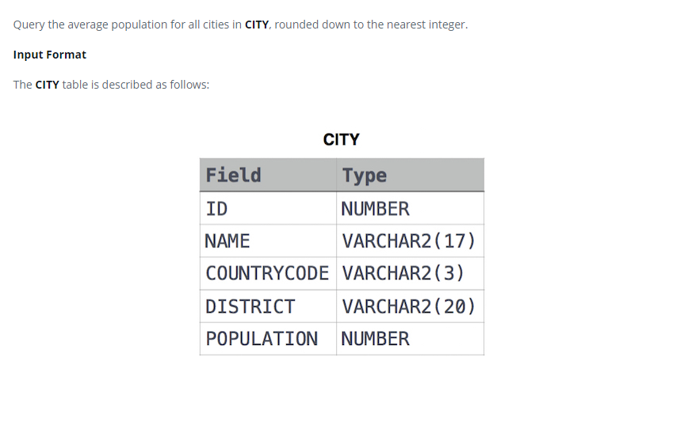

### 



#### eng:
Query the average population for all cities in CITY, rounded down to the nearest integer.

Input Format

The CITY table is described as follows:


#### рус:
Запросите среднюю численность населения для всех городов в CITY, округленную до ближайшего целого числа.

Формат ввода

Таблица CITY описывается следующим образом:


#### код с коментариями:
```sql
SELECT                          /* выбрать данные */
    ROUND(AVG(POPULATION))      /* столбец округленное среднее значение численности населения */
FROM CITY;                      /* из таблицы */
```

#### код для hackerrank:
```sql
SELECT 
    ROUND(AVG(POPULATION)) 
FROM CITY;
```


#### На [главную](https://github.com/BEPb/hackerrank_sql#readme)

---