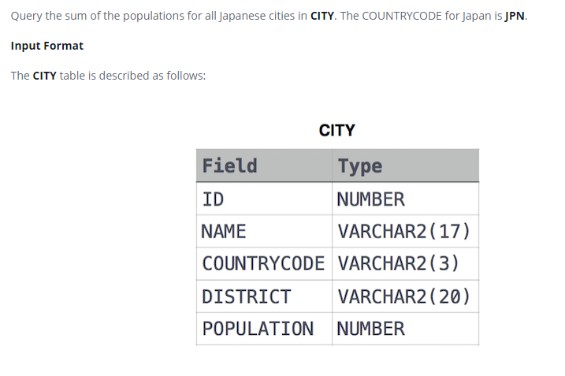

### 



#### eng:
Query the sum of the populations for all Japanese cities in CITY. The COUNTRYCODE for Japan is JPN.

Input Format

The CITY table is described as follows:


#### рус:
Запросите сумму населения для всех японских городов в CITY. КОД СТРАНЫ для Японии — JPN.

Формат ввода

Таблица CITY описывается следующим образом:


#### код с коментариями:
```sql
SELECT                          /* выбрать данные */
    SUM(POPULATION)             /* столбец сумма популяции */
FROM CITY                       /* из таблицы */
    WHERE COUNTRYCODE = 'JPN';  /* где код страны равен японскому */
```

#### код для hackerrank:
```sql
SELECT 
    SUM(POPULATION) 
FROM CITY 
    WHERE COUNTRYCODE = 'JPN';
```


#### На [главную](https://github.com/BEPb/hackerrank_sql#readme)

---