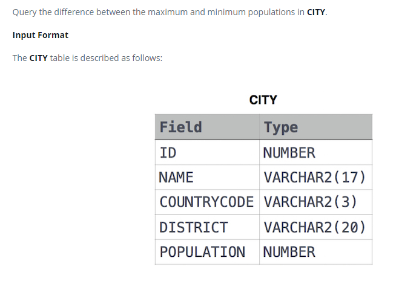

### 



#### eng:
Query the difference between the maximum and minimum populations in CITY.

Input Format

The CITY table is described as follows:


#### рус:
Запросите разницу между максимальной и минимальной численностью населения в CITY.

Формат ввода

Таблица CITY описывается следующим образом:


#### код с коментариями:
```sql
SELECT                                  /* выбрать данные */
    MAX(POPULATION) - MIN(POPULATION)   /* столбец разница максимального значения и минимального значения */
FROM CITY;                              /* из таблицы */
```

#### код для hackerrank:
```sql
SELECT 
    MAX(POPULATION) - MIN(POPULATION) 
FROM CITY;
```


#### На [главную](https://github.com/BEPb/hackerrank_sql#readme)

---