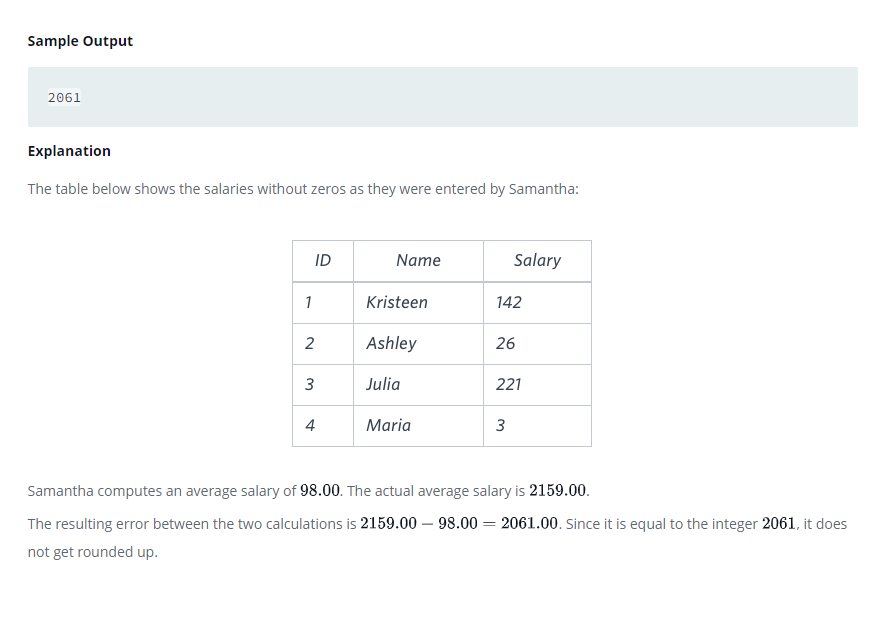

### 



#### eng:
Samantha was tasked with  calculating the average monthly salaries for all employees in the EMPLOYEES table, but did 
not realize her keyboard's   key was broken until after completing the calculation. She wants your help finding the 
difference between her miscalculation (using salaries with any zeros removed), and the actual average salary.

Write a query calculating the amount of error (i.e.:  average monthly salaries), and round it up to the next integer.


#### рус:
Саманте было поручено рассчитать  среднемесячную заработную плату для всех сотрудников в таблице EMPLOYEES, но она 
не осознавала, что клавиша на ее  клавиатуре сломана, пока не завершила расчет. Она хочет, чтобы вы помогли найти 
разницу между ее просчетом (с использованием зарплаты с удаленными нулями) и фактической средней зарплатой.

Напишите запрос, вычисляющий сумму ошибки (т. е. среднемесячную заработную плату), и округлите ее до следующего целого числа.


#### код с коментариями:
```sql
SELECT                                                          /* выбрать данные */
    ROUND(AVG(SALARY)) - ROUND(AVG(REPLACE(SALARY,'0','')))     /* столбец округленной разницы средней зарпалты и 
                                                                округленного значения замененной зарплаты */
FROM EMPLOYEES;                                                 /* из таблицы */
```

#### код для hackerrank:
```sql
SELECT 
    ROUND(AVG(SALARY)) - ROUND(AVG(REPLACE(SALARY,'0',''))) 
FROM EMPLOYEES;
```


#### На [главную](https://github.com/BEPb/hackerrank_sql#readme)

---