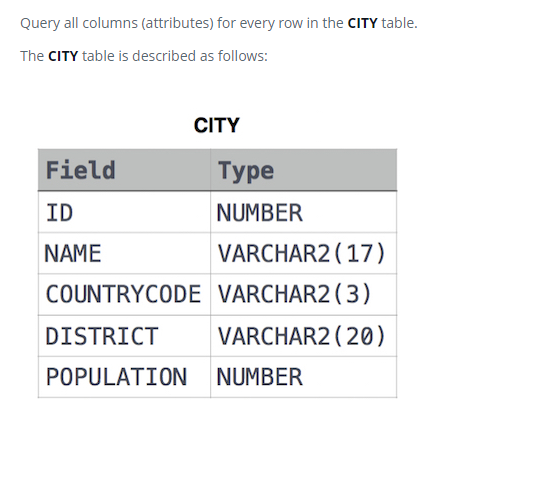

### Выбрать все [Select All]



#### eng:
Query all columns (attributes) for every row in the CITY table.
The CITY table is described as follows:


#### рус:
Запросите все столбцы (атрибуты) для каждой строки в таблице CITY.
Таблица CITY описывается следующим образом:


#### код с пояснениями:
```sql
SELECT                          /* выбрать данные */
    *                           /* всех столбцов */
FROM                            /* из */
    CITY                        /* таблицы */
```

#### код для hackerrank:
```sql
SELECT * FROM CITY
```


#### На [главную](https://github.com/BEPb/hackerrank_sql#readme)

---