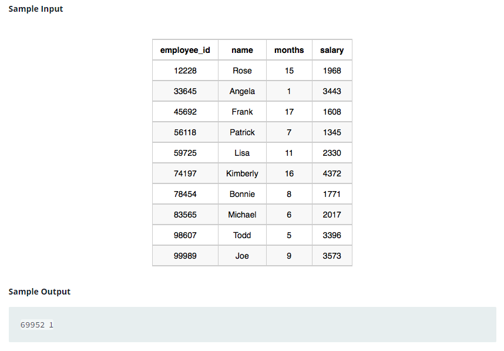

### 



#### eng:
We define an employee's total earnings to be their monthly  worked, and the maximum total earnings to be the maximum 
total earnings for any employee in the Employee table. Write a query to find the maximum total earnings for all 
employees as well as the total number of employees who have maximum total earnings. Then print these values as  
space-separated integers.   


#### рус:
Мы определяем общий заработок сотрудника как его отработанный месяц, а максимальный общий заработок — как 
максимальный общий заработок любого сотрудника в таблице «Сотрудники». Напишите запрос, чтобы найти максимальный 
общий заработок для всех сотрудников, а также общее количество сотрудников с максимальным общим заработком. Затем 
выведите эти значения как целые числа, разделенные пробелами.   


#### код с коментариями:
```sql
SELECT                                          /* выбрать данные */
    MAX(SALARY*MONTHS),                         /* столбец максимальное значение произведения */
    COUNT(SALARY*MONTHS)                        /* столбец сумма произведения */
FROM EMPLOYEE                                   /* из таблицы */
WHERE (SALARY*MONTHS) = (SELECT                 /* где выполняется условие */
                            MAX(SALARY*MONTHS) 
                         FROM EMPLOYEE);
```

#### код для hackerrank:
```sql
SELECT 
    MAX(SALARY*MONTHS), 
    COUNT(SALARY*MONTHS) 
FROM EMPLOYEE 
WHERE (SALARY*MONTHS) = (SELECT 
                            MAX(SALARY*MONTHS) 
                         FROM EMPLOYEE);
```


#### На [главную](https://github.com/BEPb/hackerrank_sql#readme)

---