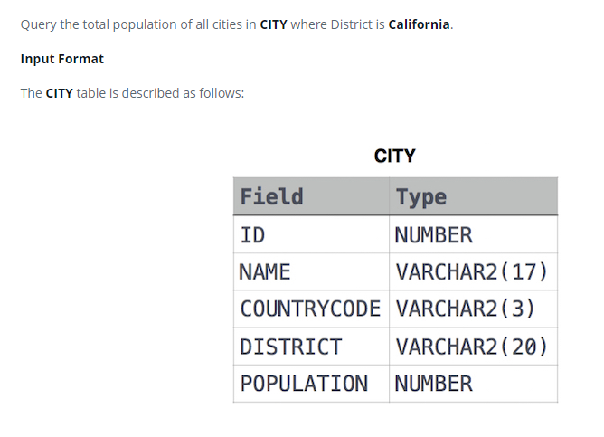

### 



#### eng:
Query the total population of all cities in CITY where District is California.

Input Format

The CITY table is described as follows:


#### рус:
Запросите общую численность населения всех городов в CITY, где District — Калифорния.

Формат ввода

Таблица CITY описывается следующим образом:


#### код с коментариями:
```sql
SELECT                              /* выбрать данные */
    SUM(POPULATION)                 /* столбец суммы населения */
FROM CITY                           /* из таблицы */
    WHERE DISTRICT = 'CALIFORNIA';  /* где условие */
```

#### код для hackerrank:
```sql
SELECT 
    SUM(POPULATION) 
FROM CITY 
    WHERE DISTRICT = 'CALIFORNIA';
```


#### На [главную](https://github.com/BEPb/hackerrank_sql#readme)

---