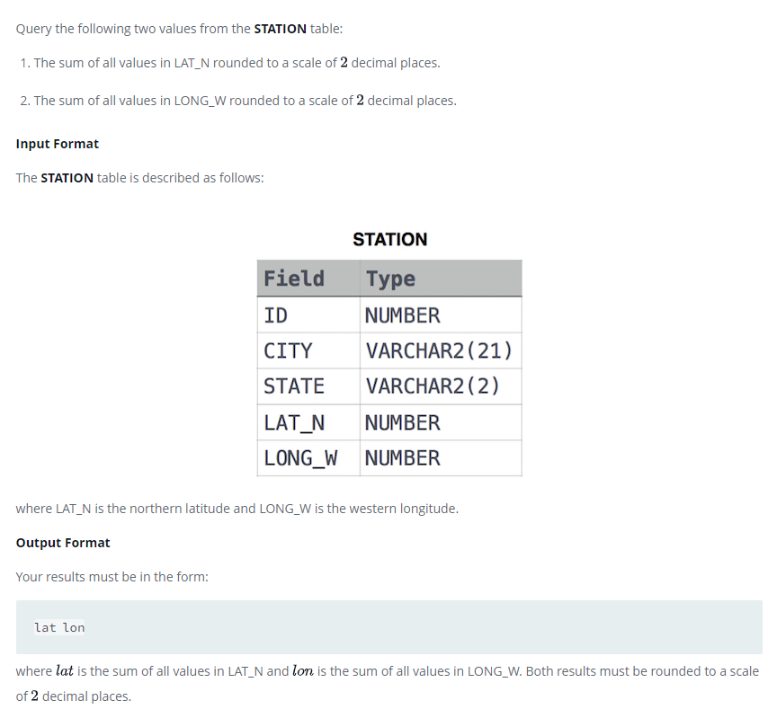

### 



#### eng:
Query the following two values from the STATION table:

The sum of all values in LAT_N rounded to a scale of  decimal places.
The sum of all values in LONG_W rounded to a scale of  decimal places.
Input Format

The STATION table is described as follows:

Station.jpg

where LAT_N is the northern latitude and LONG_W is the western longitude.


#### рус:
Запросите следующие два значения из таблицы STATION:

Сумма всех значений в LAT_N, округленная до десятичной дроби.
Сумма всех значений в LONG_W, округленная до десятичных разрядов.
Формат ввода

Таблица STATION описывается следующим образом:

Станция.jpg

где LAT_N — северная широта, а LONG_W — западная долгота.


#### код с коментариями:
```sql
SELECT                      /* выбрать данные */
    ROUND(SUM(LAT_N),2),    /* столбец */
    ROUND(SUM(LONG_W),2)    /* столбец */
FROM STATION;               /* из таблицы */
```

#### код для hackerrank:
```sql
SELECT                      
    ROUND(SUM(LAT_N),2), 
    ROUND(SUM(LONG_W),2) 
FROM STATION;
```


#### На [главную](https://github.com/BEPb/hackerrank_sql#readme)

---