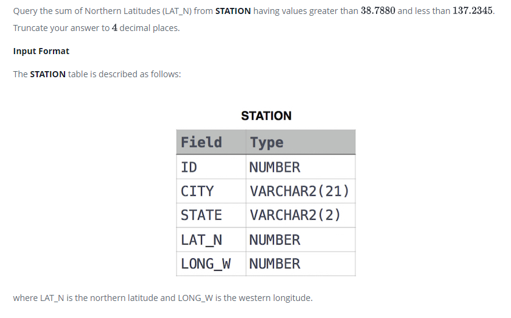

### 



#### eng:
Query the sum of Northern Latitudes (LAT_N) from STATION having values greater than .. and less than .. . Truncate your 
answer to  decimal places.

Input Format

The STATION table is described as follows:


#### рус:
Запросите сумму северных широт (LAT_N) из STATION со значениями больше .. и меньше .. . Сократите свой ответ до 
десятичных знаков.

Формат ввода

Таблица STATION описывается следующим образом:


#### код с коментариями:
```sql
SELECT                      /* выбрать данные */
    ROUND(SUM(LAT_N), 4)    /* столбец округленное значение суммы */
FROM STATION                /* из таблицы */
    WHERE                   /* где */
        LAT_N > 38.7880 AND /* условие 1 и */ 
        LAT_N < 137.2345    /* условие 2 */
```

#### код для hackerrank:
```sql
SELECT
    ROUND(SUM(LAT_N), 4) 
FROM STATION 
    WHERE 
        LAT_N > 38.7880 AND 
        LAT_N < 137.2345
```


#### На [главную](https://github.com/BEPb/hackerrank_sql#readme)

---