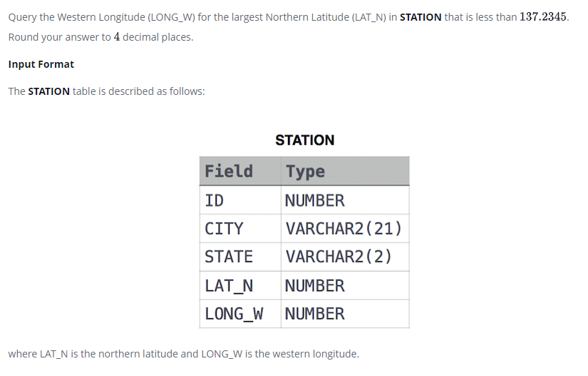

### 



#### eng:
Query the Western Longitude (LONG_W) for the largest Northern Latitude (LAT_N) in STATION that is less than . Round your answer to  decimal places.

Input Format

The STATION table is described as follows:


#### рус:
Запросите западную долготу (LONG_W) для наибольшей северной широты (LAT_N) в STATION, которая меньше . Округлите ответ до десятичных знаков.

Формат ввода

Таблица STATION описывается следующим образом:


#### код с коментариями:
```sql
SELECT                              /* выбрать данные */
    CAST(LONG_W AS DECIMAL(10,4))   /* столбец */
FROM STATION                        /* где */
    WHERE LAT_N < 137.2345          /* условие */
    ORDER BY LAT_N                  /* отсортировать по */
    DESC LIMIT 1                    /* вывести только одно значение */
```

#### код для hackerrank:
```sql
SELECT 
    CAST(LONG_W AS DECIMAL(10,4)) 
FROM STATION 
    WHERE LAT_N < 137.2345 
    ORDER BY LAT_N 
    DESC LIMIT 1
```


#### На [главную](https://github.com/BEPb/hackerrank_sql#readme)

---