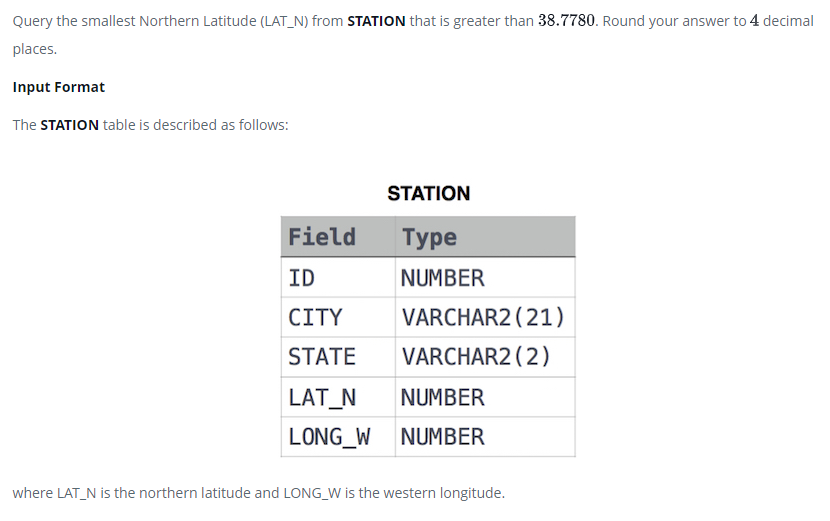

### 



#### eng:
Query the smallest Northern Latitude (LAT_N) from STATION that is greater than . Round your answer to  decimal places.

Input Format

The STATION table is described as follows:


#### рус:
Запросить наименьшую северную широту (LAT_N) из STATION, превышающую . Округлите ответ до десятичных знаков.

Формат ввода

Таблица STATION описывается следующим образом:


#### код с коментариями:
```sql
SELECT                      /* выбрать данные */
    ROUND(MIN(LAT_N),4)     /* столбец */ 
FROM STATION                /* из таблицы */
    WHERE LAT_N >38.778     /* где условие */
```

#### код для hackerrank:
```sql
SELECT 
    ROUND(MIN(LAT_N),4) 
FROM STATION 
    WHERE LAT_N >38.778
```


#### На [главную](https://github.com/BEPb/hackerrank_sql#readme)

---