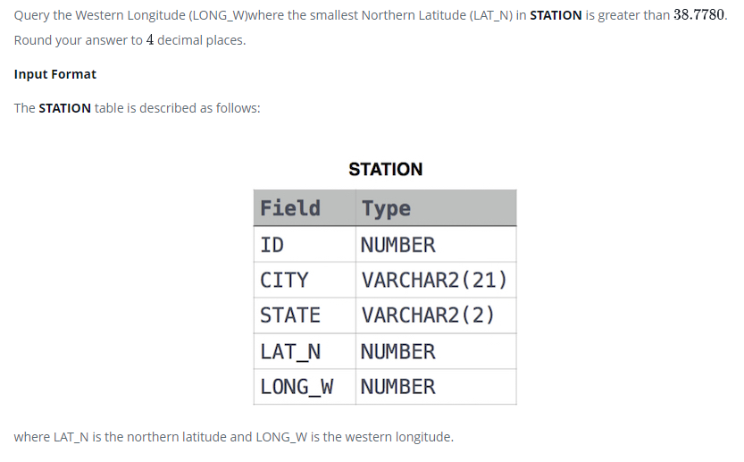

### 



#### eng:
Query the Western Longitude (LONG_W)where the smallest Northern Latitude (LAT_N) in STATION is greater than . Round your answer to  decimal places.

Input Format

The STATION table is described as follows:


#### рус:
Запросить западную долготу (LONG_W), где наименьшая северная широта (LAT_N) в STATION больше . Округлите ответ до десятичных знаков.

Формат ввода

Таблица STATION описывается следующим образом:


#### код с коментариями:
```sql
SELECT                      /* выбрать данные */
    ROUND(LONG_W,4)         /* столбец */
FROM STATION                /* из таблицы */
    WHERE LAT_N > 38.7780   /* где условие */
    ORDER BY LAT_N ASC      /* отсортировать по столбцу */
    LIMIT 1;                /* вывести одно значение */
```

#### код для hackerrank:
```sql
SELECT 
    ROUND(LONG_W,4) 
FROM STATION 
    WHERE LAT_N > 38.7780 
    ORDER BY LAT_N ASC 
    LIMIT 1;
```


#### На [главную](https://github.com/BEPb/hackerrank_sql#readme)

---