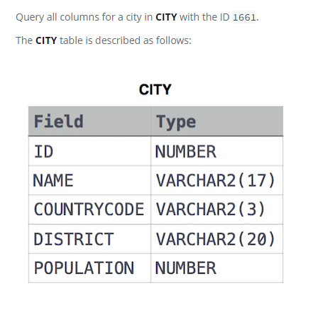

### Выбрать по идентификатору [Select By ID]



#### eng:
Query all columns for a city in CITY with the ID 1661.
The CITY table is described as follows:


#### рус:
Запросите все столбцы для города в CITY с идентификатором 1661.
Таблица CITY описывается следующим образом:


#### код с пояснениями:
```sql
SELECT *            /* выбрать все столбца */
FROM CITY           /* из таблицы */
WHERE ID = 1661     /* где условие */
```

#### код для hackerrank
```sql
SELECT * FROM CITY WHERE ID = 1661
```


#### На [главную](https://github.com/BEPb/hackerrank_sql#readme)

---