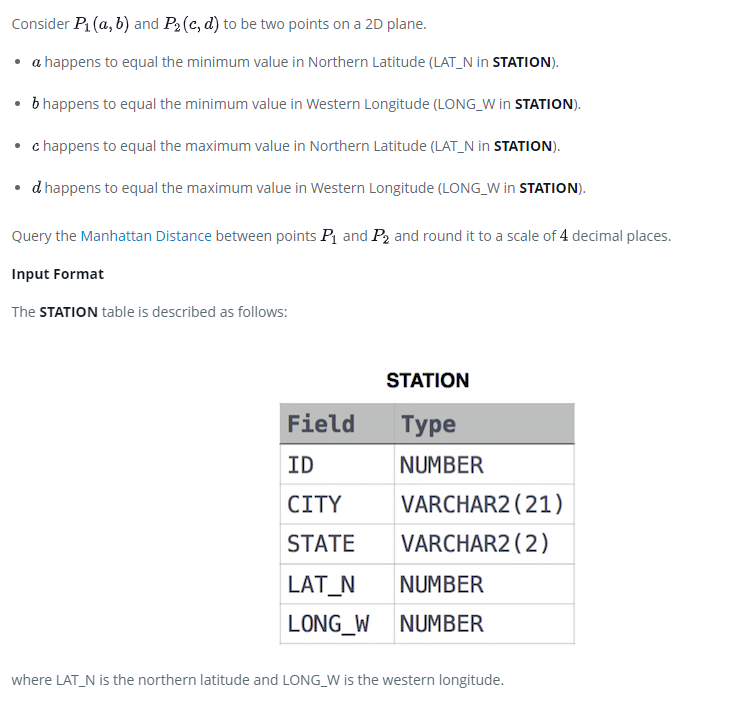

### 



#### eng:
Consider  and  to be two points on a 2D plane.

 happens to equal the minimum value in Northern Latitude (LAT_N in STATION).
 happens to equal the minimum value in Western Longitude (LONG_W in STATION).
 happens to equal the maximum value in Northern Latitude (LAT_N in STATION).
 happens to equal the maximum value in Western Longitude (LONG_W in STATION).
Query the Manhattan Distance between points  and  and round it to a scale of  decimal places.

Input Format

The STATION table is described as follows:


#### рус:
Рассмотрим и быть двумя точками на 2D-плоскости.

  оказывается равным минимальному значению в северной широте (LAT_N в STATION).
  оказывается равным минимальному значению западной долготы (LONG_W в STATION).
  оказывается равным максимальному значению в северной широте (LAT_N в STATION).
  оказывается равным максимальному значению западной долготы (LONG_W в STATION).
Запросите Манхэттенское расстояние между точками и округлите его до десятичной дроби.

Формат ввода

Таблица STATION описывается следующим образом:


#### код с коментариями:
```sql
SELECT                                                              /* выбрать данные */
    ROUND((Max(Lat_N)-Min(Lat_N))+(Max(LONG_W)-Min(LONG_W)), 4)     /* столбец */
FROM STATION                                                        /* из таблицы */
```

#### код для hackerrank:
```sql
SELECT  
    ROUND((Max(Lat_N)-Min(Lat_N))+(Max(LONG_W)-Min(LONG_W)), 4)
FROM STATION
```


#### На [главную](https://github.com/BEPb/hackerrank_sql#readme)

---