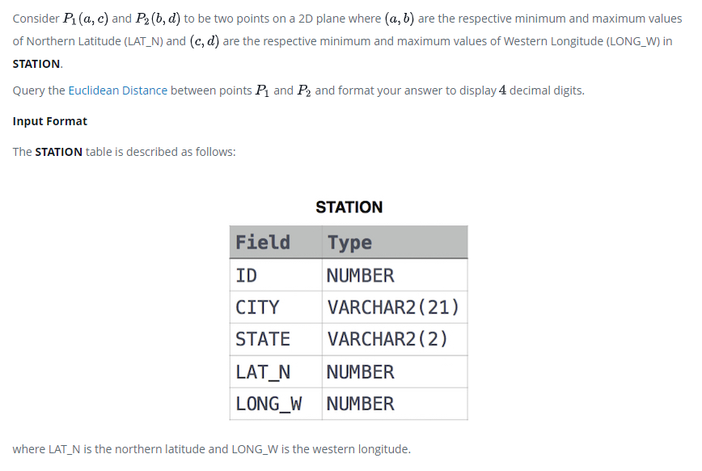

### 



#### eng:
Consider  and  to be two points on a 2D plane where  are the respective minimum and maximum values of Northern Latitude (LAT_N) and  are the respective minimum and maximum values of Western Longitude (LONG_W) in STATION.

Query the Euclidean Distance between points  and  and format your answer to display  decimal digits.

Input Format

The STATION table is described as follows:


#### рус:
Рассмотрим две точки и на двумерной плоскости, где — соответствующие минимальное и максимальное значения северной широты (LAT_N) и соответствующие минимальное и максимальное значения западной долготы (LONG_W) в STATION.

Запросите евклидово расстояние между точками и отформатируйте ответ для отображения десятичных цифр.

Формат ввода

Таблица STATION описывается следующим образом:


#### код с коментариями:
```sql
WITH CTE AS (           /* создадим временную таблицу */
SELECT                  /* выбрать данные */
    MIN(LAT_N) X1,      /* столбец */
    MAX(LAT_N) X2,      /* столбец */
    MIN(LONG_W) Y1,     /* столбец */
    MAX(LONG_W) Y2      /* столбец */
FROM STATION)           /* из таблицы */
SELECT                                                              /* выбрать данные */
    ROUND(SQRT(POWER((X2-X1), 2) + POWER((Y2-Y1),2)),4) FROM CTE;   /* выбрать данные */
```

#### код для hackerrank:
```sql
WITH CTE AS (
SELECT 
    MIN(LAT_N) X1,
    MAX(LAT_N) X2,
    MIN(LONG_W) Y1,
    MAX(LONG_W) Y2
FROM STATION)
SELECT ROUND(SQRT(POWER((X2-X1), 2) + POWER((Y2-Y1),2)),4) FROM CTE;
```


#### На [главную](https://github.com/BEPb/hackerrank_sql#readme)

---