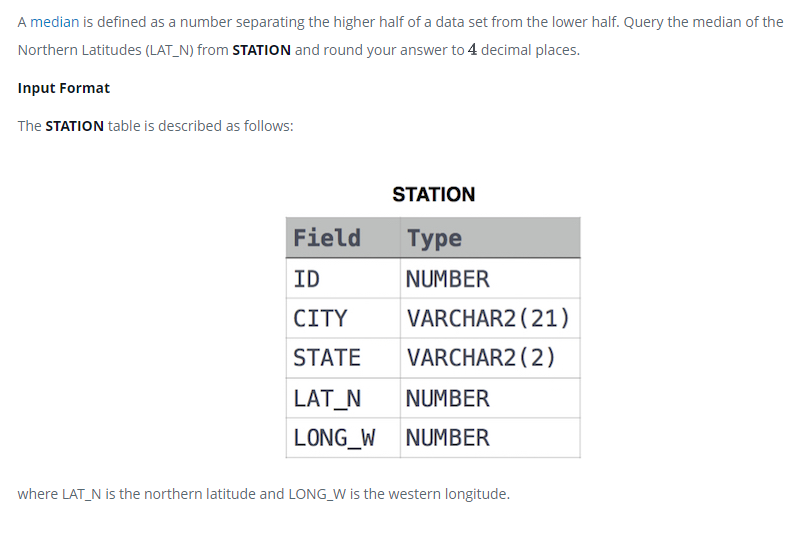

### 



#### eng:
A median is defined as a number separating the higher half of a data set from the lower half. Query the median of the Northern Latitudes (LAT_N) from STATION and round your answer to  decimal places.

Input Format

The STATION table is described as follows:


#### рус:
Медиана определяется как число, отделяющее верхнюю половину набора данных от нижней половины.  Запросите медиану 
северных широт (LAT_N) из STATION и округлите ответ до десятичных знаков.

Формат ввода

Таблица STATION описывается следующим образом:


#### код с коментариями:
```sql
SELECT                                          /* выбрать данные */
    ROUND(LAT_N,4)                              /* столбец */
FROM                                            /* из таблицы */
    (SELECT                                     /* выбрать данные */
        LAT_N,                                  /* столбец */
        PERCENT_RANK() OVER (ORDER BY LAT_N) AS PERCENTILE     /* столбец с псевданимом */
     FROM STATION) AS A                         /* из таблицы */
WHERE PERCENTILE = 0.5;                         /* где условие */
```

#### код для hackerrank:
```sql
SELECT 
    ROUND(LAT_N,4) 
FROM 
    (SELECT 
        LAT_N,
        PERCENT_RANK() 
        OVER (ORDER BY LAT_N) AS PERCENTILE 
     FROM STATION) AS A 
WHERE PERCENTILE = 0.5;
```


#### На [главную](https://github.com/BEPb/hackerrank_sql#readme)

---