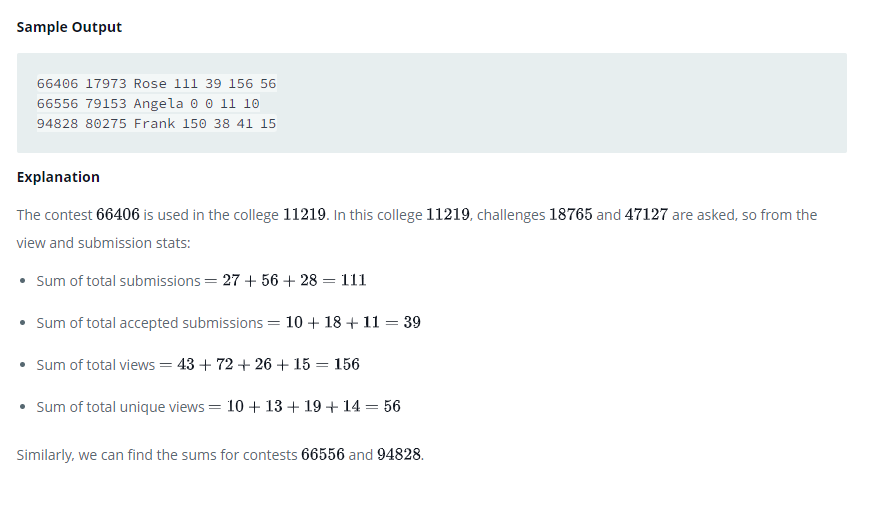

### 



#### eng:
Samantha interviews many candidates from different  colleges using coding challenges and contests. Write a query to 
print the contest_id, hacker_id, name, and the sums  of total_submissions, total_accepted_submissions, total_views, 
and total_unique_views for each contest sorted by contest_id. Exclude the contest from the result if all four sums are .

Note: A specific contest can be used to screen candidates at more than one college, but each college only holds  
screening contest. 


#### рус:
Саманта берет интервью у многих кандидатов из разных  колледжей, используя задачи и конкурсы по программированию. 
Напишите запрос для вывода идентификатора конкурса,  идентификатора хакера, имени и сумм total_submissions, 
total_accepted_submissions, total_views и total_unique_views  для каждого конкурса, отсортированного по конкурсу_id. 
Исключить конкурс из результата, если все четыре суммы равны .

Примечание. Определенный конкурс может использоваться для отбора кандидатов более чем в одном колледже, но каждый 
колледж проводит только отборочный конкурс. 


#### код с коментариями:
```sql
WITH TOTAL_SUBMISSION_STATS AS (
    SELECT CHALLENGE_ID, 
    SUM(TOTAL_SUBMISSIONS) AS GRAND_TOTAL_SUBMISSIONS, 
    SUM(TOTAL_ACCEPTED_SUBMISSIONS) AS GRAND_TOTAL_ACCEPTED_SUBMISSIONS
    FROM SUBMISSION_STATS
    GROUP BY CHALLENGE_ID
), TOTAL_VIEW_STATS AS (
    SELECT CHALLENGE_ID, 
    SUM(TOTAL_VIEWS) AS GRAND_TOTAL_VIEWS, 
    SUM(TOTAL_UNIQUE_VIEWS) AS GRAND_TOTAL_UNIQUE_VIEWS
    FROM VIEW_STATS
    GROUP BY CHALLENGE_ID
)
SELECT C1.CONTEST_ID, HACKER_ID, NAME,
    SUM(GRAND_TOTAL_SUBMISSIONS),
    SUM(GRAND_TOTAL_ACCEPTED_SUBMISSIONS), 
    SUM(GRAND_TOTAL_VIEWS), 
    SUM(GRAND_TOTAL_UNIQUE_VIEWS) 
FROM 
    CONTESTS C1 
    LEFT JOIN COLLEGES C2 ON C1.CONTEST_ID = C2.CONTEST_ID 
    LEFT JOIN CHALLENGES C3 ON C2.COLLEGE_ID = C3.COLLEGE_ID
    LEFT JOIN TOTAL_VIEW_STATS V ON C3.CHALLENGE_ID = V.CHALLENGE_ID
    LEFT JOIN TOTAL_SUBMISSION_STATS S ON C3.CHALLENGE_ID = S.CHALLENGE_ID
GROUP BY 
    C1.CONTEST_ID, HACKER_ID, NAME
HAVING 
    SUM(GRAND_TOTAL_SUBMISSIONS) + 
    SUM(GRAND_TOTAL_ACCEPTED_SUBMISSIONS) +
    SUM(GRAND_TOTAL_VIEWS) +
    SUM(GRAND_TOTAL_UNIQUE_VIEWS) != 0
ORDER BY C1.CONTEST_ID;
```

#### код для hackerrank:
```sql
WITH TOTAL_SUBMISSION_STATS AS (
    SELECT CHALLENGE_ID, 
    SUM(TOTAL_SUBMISSIONS) AS GRAND_TOTAL_SUBMISSIONS, 
    SUM(TOTAL_ACCEPTED_SUBMISSIONS) AS GRAND_TOTAL_ACCEPTED_SUBMISSIONS
    FROM SUBMISSION_STATS
    GROUP BY CHALLENGE_ID
), TOTAL_VIEW_STATS AS (
    SELECT CHALLENGE_ID, 
    SUM(TOTAL_VIEWS) AS GRAND_TOTAL_VIEWS, 
    SUM(TOTAL_UNIQUE_VIEWS) AS GRAND_TOTAL_UNIQUE_VIEWS
    FROM VIEW_STATS
    GROUP BY CHALLENGE_ID
)
SELECT C1.CONTEST_ID, HACKER_ID, NAME,
    SUM(GRAND_TOTAL_SUBMISSIONS),
    SUM(GRAND_TOTAL_ACCEPTED_SUBMISSIONS), 
    SUM(GRAND_TOTAL_VIEWS), 
    SUM(GRAND_TOTAL_UNIQUE_VIEWS) 
FROM 
    CONTESTS C1 
    LEFT JOIN COLLEGES C2 ON C1.CONTEST_ID = C2.CONTEST_ID 
    LEFT JOIN CHALLENGES C3 ON C2.COLLEGE_ID = C3.COLLEGE_ID
    LEFT JOIN TOTAL_VIEW_STATS V ON C3.CHALLENGE_ID = V.CHALLENGE_ID
    LEFT JOIN TOTAL_SUBMISSION_STATS S ON C3.CHALLENGE_ID = S.CHALLENGE_ID
GROUP BY 
    C1.CONTEST_ID, HACKER_ID, NAME
HAVING 
    SUM(GRAND_TOTAL_SUBMISSIONS) + 
    SUM(GRAND_TOTAL_ACCEPTED_SUBMISSIONS) +
    SUM(GRAND_TOTAL_VIEWS) +
    SUM(GRAND_TOTAL_UNIQUE_VIEWS) != 0
ORDER BY C1.CONTEST_ID;
```


#### На [главную](https://github.com/BEPb/hackerrank_sql#readme)

---