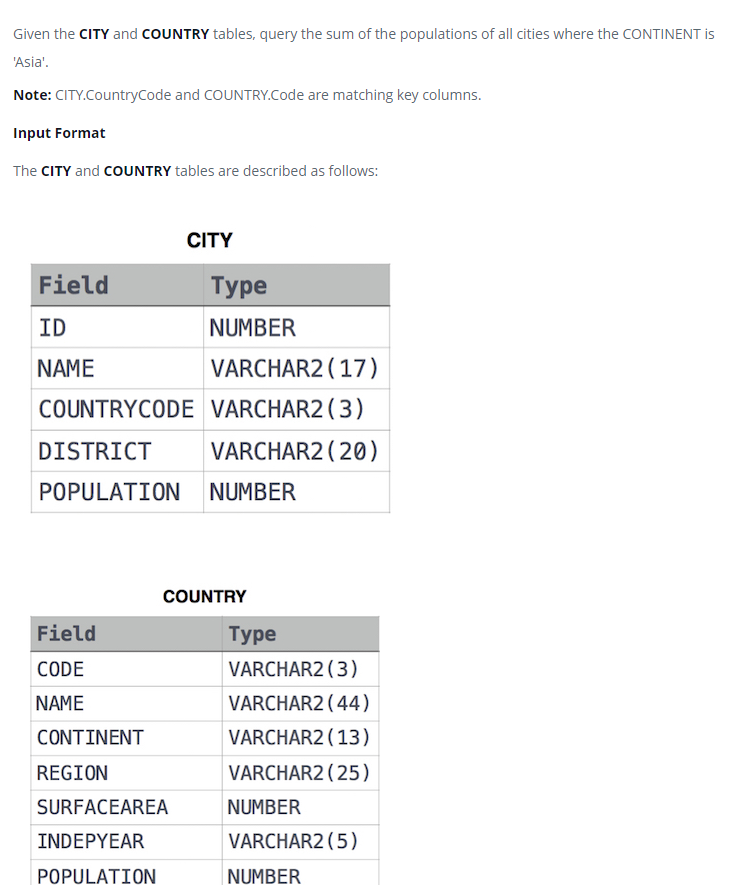

### 



#### eng:
Given the CITY and COUNTRY tables, query the sum of the populations of all cities where the CONTINENT is 'Asia'.

Note: CITY.CountryCode and COUNTRY.Code are matching key columns.


#### рус:
Имея таблицы CITY и COUNTRY, запросите сумму населения всех городов, где CONTINENT — «Азия».

Примечание. CITY.CountryCode и COUNTRY.Code соответствуют ключевым столбцам.


#### код с коментариями:
```sql
SELECT                              /* выбрать данные */
    SUM(CITY.POPULATION)            /* столбец */
FROM CITY                           /* из таблицы */
INNER JOIN COUNTRY                  /* объединить с таблицей */
ON CITY.COUNTRYCODE = COUNTRY.CODE  /* по коду страны */
WHERE COUNTRY.CONTINENT = 'Asia'    /* где условие */
```

#### код для hackerrank:
```sql
SELECT
    SUM(CITY.POPULATION)
FROM CITY INNER JOIN COUNTRY
    ON CITY.COUNTRYCODE = COUNTRY.CODE
    WHERE COUNTRY.CONTINENT = 'Asia';
```


#### На [главную](https://github.com/BEPb/hackerrank_sql#readme)

---