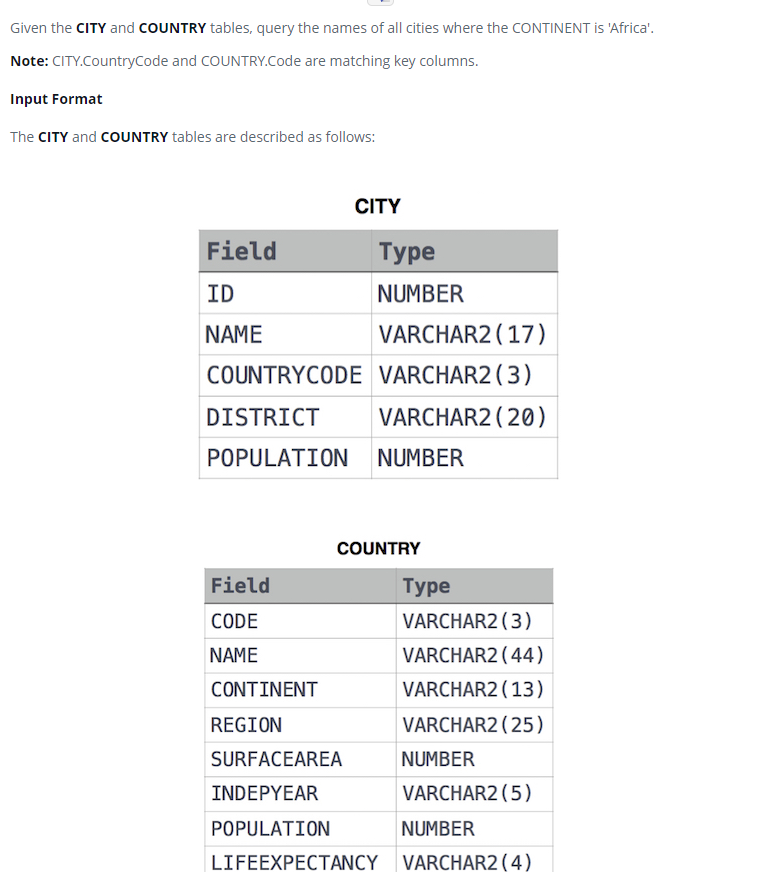

### 



#### eng:
Given the CITY and COUNTRY tables, query the names of all cities where the CONTINENT is 'Africa'.

Note: CITY.CountryCode and COUNTRY.Code are matching key columns.


#### рус:
Имея таблицы CITY и COUNTRY, запросите названия всех городов, где CONTINENT — «Африка».

Примечание. CITY.CountryCode и COUNTRY.Code соответствуют ключевым столбцам.


#### код с коментариями:
```sql
SELECT 
    CITY.NAME
FROM CITY INNER JOIN COUNTRY
    ON CITY.COUNTRYCODE = COUNTRY.CODE
    WHERE COUNTRY.CONTINENT = 'Africa';
```

#### код для hackerrank:
```sql
SELECT 
    CITY.NAME
FROM CITY INNER JOIN COUNTRY
    ON CITY.COUNTRYCODE = COUNTRY.CODE
    WHERE COUNTRY.CONTINENT = 'Africa';
```


#### На [главную](https://github.com/BEPb/hackerrank_sql#readme)

---