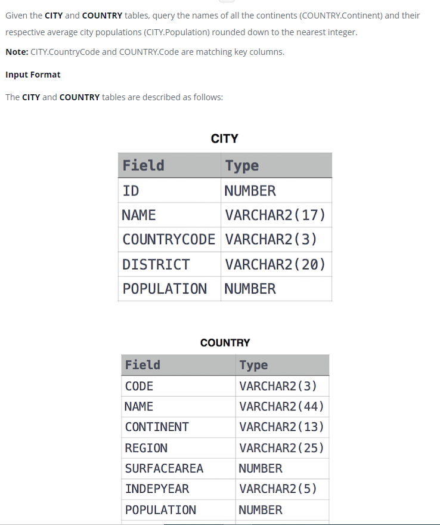

### 



#### eng:
Given the CITY and COUNTRY tables, query the names of all the continents (COUNTRY.Continent) and their respective average city populations (CITY.Population) rounded down to the nearest integer.

Note: CITY.CountryCode and COUNTRY.Code are matching key columns.


#### рус:
Имея таблицы CITY и COUNTRY, запросите названия всех континентов (COUNTRY.Continent) и соответствующее среднее население городов (CITY.Population), округленное до ближайшего целого числа.

Примечание. CITY.CountryCode и COUNTRY.Code соответствуют ключевым столбцам.


#### код с коментариями:
```sql
SELECT                                  /* выбрать данные */
    COUNTRY.CONTINENT,                  /* столбец */
    FLOOR(AVG(CITY.POPULATION))         /* столбец */
FROM CITY JOIN COUNTRY                  /* из таблицы объединенной с таблицей */
    ON CITY.COUNTRYCODE = COUNTRY.CODE  /* по коду страны */
    GROUP BY CONTINENT;                 /* сгруппировать по .. */
```

#### код для hackerrank:
```sql
SELECT 
    COUNTRY.CONTINENT,
    FLOOR(AVG(CITY.POPULATION)) 
FROM CITY JOIN COUNTRY 
    ON CITY.COUNTRYCODE = COUNTRY.CODE 
    GROUP BY CONTINENT;
```


#### На [главную](https://github.com/BEPb/hackerrank_sql#readme)

---