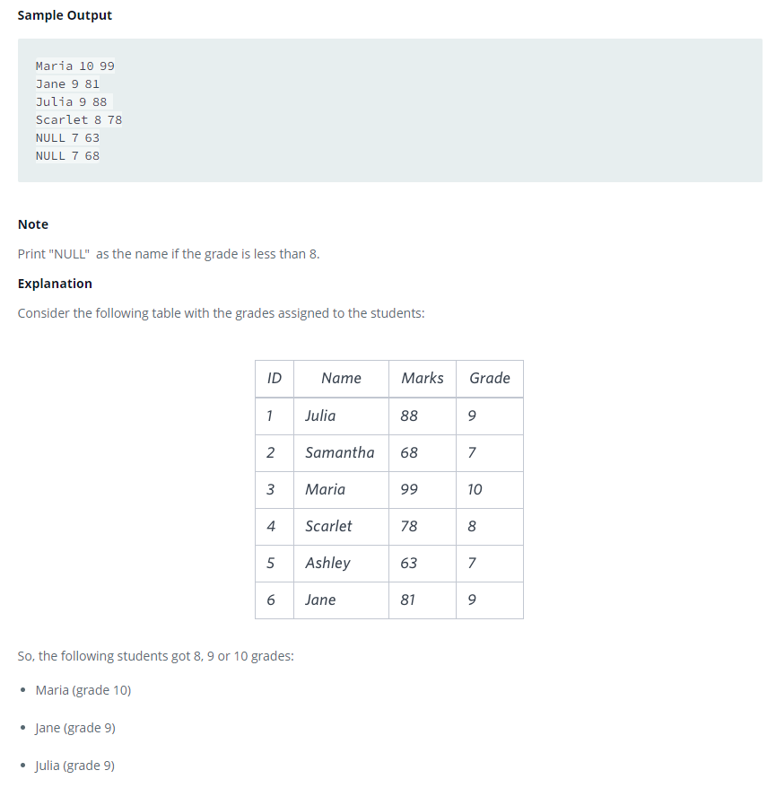

### 



#### eng:
You are given two tables: Students and Grades. Students contains three columns ID, Name and Marks.


Grades contains the following data:


Ketty gives Eve a task to generate  a report containing three columns: Name, Grade and Mark. Ketty doesn't want the 
NAMES of those students who received  a grade lower than 8. The report must be in descending order by grade -- i.e. 
higher grades are entered first. If  there is more than one student with the same grade (8-10) assigned to them, 
order those particular students by their  name alphabetically. Finally, if the grade is lower than 8, use "NULL" as 
their name and list them by their grades  in descending order. If there is more than one student with the same grade 
(1-7) assigned to them, order those particular students by their marks in ascending order.

Write a query to help Eve.


#### рус:
Вам даны две таблицы: Студенты и Оценки. Студенты содержит три столбца ID, имя и отметки.


Оценки содержат следующие данные:


Кетти дает Еве задание создать отчет, содержащий три столбца:  Имя, Оценка и Оценка. Кетти не нужны ИМЕНА тех 
учеников, которые получили оценки ниже 8. Отчет должен быть в  порядке убывания оценок, т. е. более высокие оценки 
вводятся первыми. Если есть более одного ученика с одинаковой  оценкой (8-10), упорядочите этих конкретных учеников 
по их именам в алфавитном порядке. Наконец, если оценка ниже 8,  используйте «NULL» в качестве их имени и 
перечислите их по их оценкам в порядке убывания. Если есть более  одного учащегося с одинаковой оценкой (1-7), 
упорядочите этих конкретных учащихся по их оценкам в порядке возрастания.

Напишите запрос, чтобы помочь Еве.


#### код с коментариями:
```sql
SELECT                                          /* выбрать данные */
    CASE WHEN B.GRADE < 8 THEN NULL             /* столбец по условию */
    ELSE A.NAME END AS NAME,
    B.GRADE,                                    /* столбец */
    A.MARKS                                     /* столбец */
FROM STUDENTS A                                 /* из таблицы */
INNER JOIN GRADES B                             /* объединенной с таблицей */
ON A.MARKS BETWEEN B.MIN_MARK AND B.MAX_MARK    /* по столбцу */
ORDER BY B.GRADE DESC, NAME, A.MARKS            /* отсортировать по */
```

#### код для hackerrank:
```sql
SELECT 
    CASE WHEN B.GRADE < 8 THEN NULL
    ELSE A.NAME END AS NAME,
    B.GRADE,
    A.MARKS
FROM STUDENTS A
INNER JOIN GRADES B
ON A.MARKS BETWEEN B.MIN_MARK AND B.MAX_MARK
ORDER BY 
    B.GRADE DESC, NAME, A.MARKS
```


#### На [главную](https://github.com/BEPb/hackerrank_sql#readme)

---