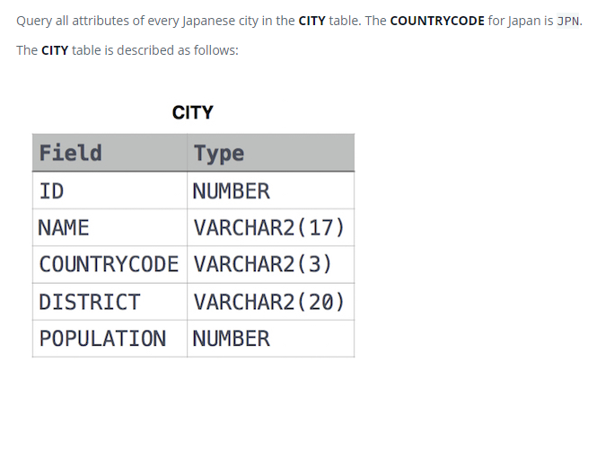

### Атрибуты японских городов [Japanese Cities' Attributes]



#### eng:
Query all attributes of every Japanese city in the CITY table. The COUNTRYCODE for Japan is JPN.
The CITY table is described as follows:


#### рус:
Запросите все атрибуты каждого японского города в таблице CITY. КОД СТРАНЫ для Японии — JPN.
Таблица CITY описывается следующим образом:


#### код с пояснениями:
```sql
SELECT *                    /* выбрать данные всех столбцов */
FROM CITY                   /* из таблицы */
WHERE COUNTRYCODE = 'JPN'   /* где условие */
```

#### код для hackerrank
```sql
SELECT * FROM CITY WHERE COUNTRYCODE = 'JPN'
```


#### На [главную](https://github.com/BEPb/hackerrank_sql#readme)

---