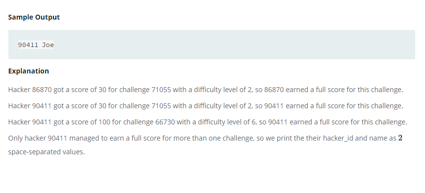

### 



#### eng:
Julia just finished conducting a coding contest, and she needs your help assembling the leaderboard! Write a query 
to print the respective hacker_id and name of hackers who achieved full scores for more than one challenge. Order 
your output in descending order by the total number of challenges in which the hacker earned a full score. If more 
than one hacker received full scores in same number of challenges, then sort them by ascending hacker_id.   


#### рус:
Джулия только что закончила соревнование по программированию, и ей нужна твоя помощь в составлении таблицы лидеров! 
Напишите запрос для вывода соответствующего hacker_id и имен хакеров, набравших максимальное количество баллов за 
более чем одну задачу. Упорядочите результат в порядке убывания общего количества испытаний, в которых хакер 
заработал полный балл. Если несколько хакеров получили полные баллы за одинаковое количество испытаний, отсортируйте 
их по возрастанию hacker_id.    


#### код с коментариями:
```sql
SELECT                                                                  /* выбрать данные */
    h.hacker_id,                                                        /* столбец  */
    h.name                                                              /* столбец */
FROM Submissions s                                                      /* из таблицы */
    INNER JOIN Challenges c on s.challenge_id = c.challenge_id          /* объединенная с таблицей по столбцу */
    INNER JOIN Difficulty d on d.difficulty_level = c.difficulty_level  /* объединенная с таблицей по столбцу */
    INNER JOIN Hackers h on s.hacker_id = h.hacker_id                   /* объединенная с таблицей по столбцу */
WHERE d.score = s.score                                                 /* где условие */
GROUP BY h.hacker_id,h.name                                             /* сгруппировать по  */
HAVING COUNT(s.hacker_id) > 1                                           /* где условие */
ORDER BY COUNT(s.challenge_id) desc,s.hacker_id;                        /* отсортировать по */
```

#### код для hackerrank:
```sql
SELECT 
    h.hacker_id,
    h.name 
FROM Submissions s
    INNER JOIN Challenges c on s.challenge_id = c.challenge_id
    INNER JOIN Difficulty d on d.difficulty_level = c.difficulty_level
    INNER JOIN Hackers h on s.hacker_id = h.hacker_id
WHERE d.score = s.score
GROUP BY h.hacker_id,h.name
HAVING COUNT(s.hacker_id) > 1
ORDER BY COUNT(s.challenge_id) desc,s.hacker_id;
```


#### На [главную](https://github.com/BEPb/hackerrank_sql#readme)

---