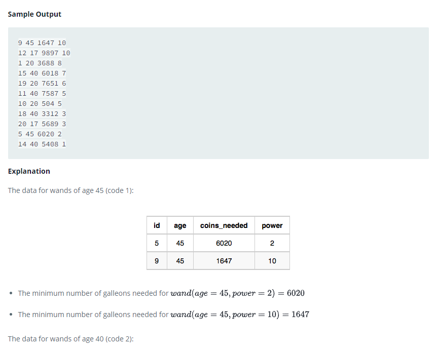

### 



#### eng:
Harry Potter and his friends are at Ollivander's with Ron, finally replacing Charlie's old broken wand.

Hermione decides the best way to choose is by determining the minimum number of gold galleons needed to buy each 
non-evil wand of high power and age. Write a query to print the id, age, coins_needed, and power of the wands that 
Ron's interested in, sorted in order of descending power. If more than one wand has same power, sort the result in 
order of descending age.   


#### рус:
Гарри Поттер и его друзья находятся у Олливандера с Роном, наконец заменяя старую сломанную палочку Чарли.

Гермиона решает, что лучший способ сделать выбор — определить минимальное количество золотых галеонов, необходимое 
для покупки каждой незлой палочки большой силы и возраста. Напишите запрос для вывода идентификатора, возраста, 
требуемых монет и мощности жезлов, которые интересуют Рона, отсортированных в порядке убывания мощности. Если 
несколько жезлов имеют одинаковую силу, отсортируйте результат в порядке убывания возраста.   


#### код с коментариями:
```sql
SELECT                          /* выбрать данные */
    id,                         /* столбец */
    age,                        /* столбец */
    coins_needed,               /* столбец */
    power                       /* столбец */
FROM WANDS AS W INNER JOIN WANDS_PROPERTY AS P                      /* из таблицы объединенной с таблицей */
ON W.code = P.code                                                  /* по столбцу */
WHERE P.is_evil = 0 AND                                             /* где условие1 и */
W.coins_needed = (SELECT MIN(coins_needed)                          /* условие 2 */
                  FROM WANDS AS W1 INNER JOIN WANDS_PROPERTY AS P1  
                  ON W1.code = P1.code                              
                  WHERE W.power = W1.power AND P.age = P1.age)      
ORDER BY W.POWER DESC, P.AGE DESC;                                  /* отсортировать по */
```

#### код для hackerrank:
```sql
SELECT 
    id, 
    age, 
    coins_needed, 
    power
FROM WANDS AS W INNER JOIN WANDS_PROPERTY AS P
ON W.code = P.code
WHERE P.is_evil = 0 AND
W.coins_needed = (SELECT MIN(coins_needed)
                  FROM WANDS AS W1 INNER JOIN WANDS_PROPERTY AS P1 
                  ON W1.code = P1.code
                  WHERE W.power = W1.power AND P.age = P1.age)
ORDER BY W.POWER DESC, P.AGE DESC;
```


#### На [главную](https://github.com/BEPb/hackerrank_sql#readme)

---