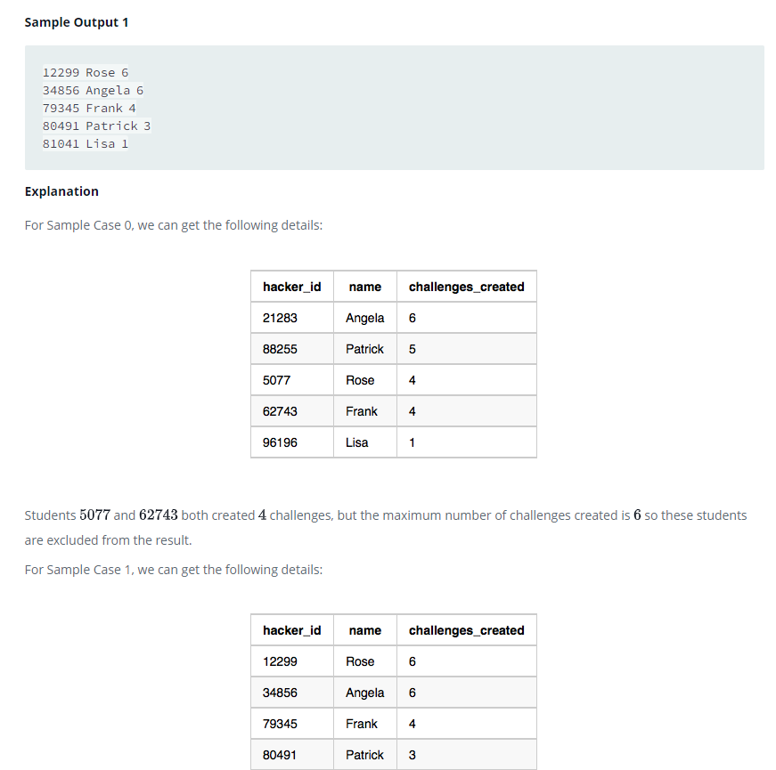

### 



#### eng:
Julia asked her students to create some coding challenges. Write a query to print the hacker_id, name, and the total 
number of challenges created by each student. Sort your results by the total number of challenges in descending 
order. If more than one student created the same number of challenges, then sort the result by hacker_id. If more 
than one student created the same number of challenges and the count is less than the maximum number of challenges 
created, then exclude those students from the result.    


#### рус:
Джулия попросила своих учеников создать несколько задач по программированию. Напишите запрос, чтобы вывести 
hacker_id, имя и общее количество задач, созданных каждым учеником. Отсортируйте результаты по общему количеству 
задач в порядке убывания. Если более одного ученика создали одинаковое количество задач, отсортируйте результат по 
hacker_id. Если более одного учащегося создали одинаковое количество задач, а их количество меньше максимального 
количества созданных задач, то эти учащиеся исключаются из результатов.    


#### код с коментариями:
```sql
WITH count_challenge AS (                               /* создадим временную таблицу */
    SELECT                                              /* выбрать данные */
        Hackers.hacker_id,                              /* столбец */
        name,                                           /* столбец */
        COUNT(challenge_id) AS num_of_chal              /* столбец */
    FROM Hackers, Challenges                            /* из таблицы */
    WHERE Hackers.hacker_id = Challenges.hacker_id      /* где условие */
    GROUP BY Hackers.hacker_id, name),                  /* сгруппировать по столбцу */
max_challenge AS (
    SELECT                                              /* выбрать данные */
        MAX(count_challenge.num_of_chal) AS max_count   /* столбец */
    FROM count_challenge),                              /* из таблицы */
count_num_challenge AS (
    SELECT                                              /* выбрать данные */
        DISTINCT num_of_chal,                           /* столбец */
        COUNT(num_of_chal) AS count_num                 /* столбец */
    FROM count_challenge                                /* из таблицы */
    GROUP BY num_of_chal                                /* сгруппировать по столбцу */
)
    
SELECT                                                  /* выбрать данные */
    Hackers.hacker_id,                                  /* столбец */
    Hackers.name,                                       /* столбец */
    cc.num_of_chal                                      /* столбец */
FROM Hackers, count_challenge cc, count_num_challenge cnc, max_challenge                /* из таблицы */
WHERE   Hackers.hacker_id = cc.hacker_id &&                                             /* где условие */
        cc.num_of_chal = cnc.num_of_chal &&
        (count_num > 1 && cnc.num_of_chal = max_challenge.max_count || count_num = 1) 
ORDER BY num_of_chal DESC, hacker_id;                   /* отсортировть по */
```

#### код для hackerrank:
```sql
WITH count_challenge AS (
    SELECT 
        Hackers.hacker_id, 
        name, 
        COUNT(challenge_id) AS num_of_chal
    FROM Hackers, Challenges
    WHERE Hackers.hacker_id = Challenges.hacker_id
    GROUP BY Hackers.hacker_id, name), 
max_challenge AS (
    SELECT 
        MAX(count_challenge.num_of_chal) AS max_count
    FROM count_challenge),
count_num_challenge AS (
    SELECT 
        DISTINCT num_of_chal, 
        COUNT(num_of_chal) AS count_num
    FROM count_challenge
    GROUP BY num_of_chal
)
    
SELECT 
    Hackers.hacker_id, 
    Hackers.name, 
    cc.num_of_chal
FROM Hackers, count_challenge cc, count_num_challenge cnc, max_challenge
WHERE   Hackers.hacker_id = cc.hacker_id &&
        cc.num_of_chal = cnc.num_of_chal &&
        (count_num > 1 && cnc.num_of_chal = max_challenge.max_count || count_num = 1) 
ORDER BY num_of_chal DESC, hacker_id;
```


#### На [главную](https://github.com/BEPb/hackerrank_sql#readme)

---