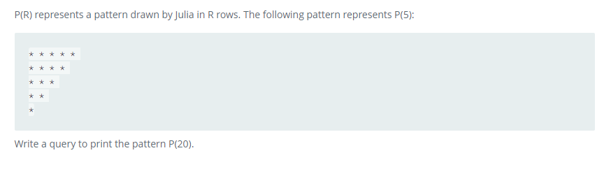

### 



#### eng:
P(R) represents a pattern drawn by Julia in R rows. The following pattern represents P(5):


Write a query to print the pattern P(20).


#### рус:
P(R) представляет узор, нарисованный Джулией в R рядах. Следующий шаблон представляет P(5):


Напишите запрос для печати шаблона P(20).


#### код с коментариями:
```sql
WITH RECURSIVE CTE AS ( /* создадим временную таблицу */
    SELECT              /* выбрать данные */
        20 AS U         /* столбец */
    UNION ALL           /* объединить все */
    SELECT              /* выбрать данные */
        U - 1 AS U      /* столбец */
    FROM CTE WHERE U > 1 /* из таблицы */
)
SELECT                  /* выбрать данные */
    REPEAT('* ', U)     /* повторить */
FROM CTE;               /* из таблицы */
```

#### код для hackerrank:
```sql
WITH RECURSIVE CTE AS (
    SELECT 
        20 AS U
    UNION ALL
    SELECT 
        U - 1 AS U 
    FROM CTE WHERE U > 1
)
SELECT 
    REPEAT('* ', U)  
FROM CTE;
```


#### На [главную](https://github.com/BEPb/hackerrank_sql#readme)

---