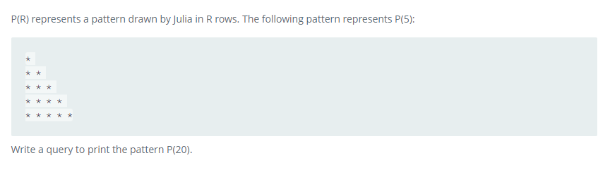

### 



#### eng:
P(R) represents a pattern drawn by Julia in R rows. The following pattern represents P(5):

Write a query to print the pattern P(20).


#### рус:
P(R) представляет узор, нарисованный Джулией в R рядах. Следующий шаблон представляет P(5):

Напишите запрос для печати шаблона P(20).


#### код с коментариями:
```sql
WITH recursive temp_table AS (          /* создадим временную таблицу */
    SELECT                              /* выбрать данные */
        1 AS u,                         /* столбец */
        CAST('*' as CHAR(50)) AS result /* столбец */ 
        UNION ALL                       /* объединить все */
    SELECT u + 1,                       /* выбрать данные */
    repeat('* ', u + 1) AS result       /* повторить */
    FROM temp_table WHERE u < 20        /* из таблицы */
)

SELECT result FROM temp_table;
```

#### код для hackerrank:
```sql
WITH recursive temp_table AS (
    SELECT 
        1 AS u, 
        CAST('*' as CHAR(50)) AS result  
        UNION ALL
    SELECT u + 1, 
    repeat('* ', u + 1) AS result 
    FROM temp_table WHERE u < 20
)

SELECT result FROM temp_table;
```


#### На [главную](https://github.com/BEPb/hackerrank_sql#readme)

---