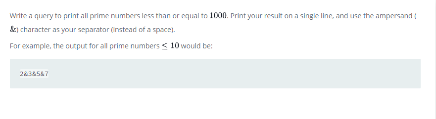

### 



#### eng:
Write a query to print all prime numbers less than or equal to . Print your result on a single line, and use the ampersand () character as your separator (instead of a space).

For example, the output for all prime numbers  would be:


#### рус:
Напишите запрос, чтобы вывести все простые числа, меньшие или равные . Выведите результат в одну строку и используйте символ амперсанда () в качестве разделителя (вместо пробела).

Например, вывод для всех простых чисел будет таким:


#### код с коментариями:
```sql
SELECT 
    CONCAT(2, '&', REPLACE(GROUP_CONCAT(T2.n ORDER BY T2.n), ',', '&')) 
FROM 
    ( SELECT 
        T.n FROM ( WITH recursive counter AS ( 
            SELECT  
                2 AS n 
                UNION SELECT 
                    n + 1 
                FROM counter 
                WHERE n < 1000 ) 
             SELECT 
                c1.n AS n, 
                MOD(c1.n, c2.n) AS r 
                FROM counter AS c1, 
        counter AS c2 
        WHERE c1.n > c2.n ) AS T 
        GROUP BY T.n 
        HAVING MIN(T.r) > 0 
        ORDER BY T.n ) AS T2;

```

#### код для hackerrank:
```sql
SELECT 
    CONCAT(2, '&', REPLACE(GROUP_CONCAT(T2.n ORDER BY T2.n), ',', '&')) 
FROM 
    ( SELECT 
        T.n FROM ( WITH recursive counter AS ( 
            SELECT  
                2 AS n 
                UNION SELECT 
                    n + 1 
                FROM counter 
                WHERE n < 1000 ) 
             SELECT 
                c1.n AS n, 
                MOD(c1.n, c2.n) AS r 
                FROM counter AS c1, 
        counter AS c2 
        WHERE c1.n > c2.n ) AS T 
        GROUP BY T.n 
        HAVING MIN(T.r) > 0 
        ORDER BY T.n ) AS T2;

```


#### На [главную](https://github.com/BEPb/hackerrank_sql#readme)

---