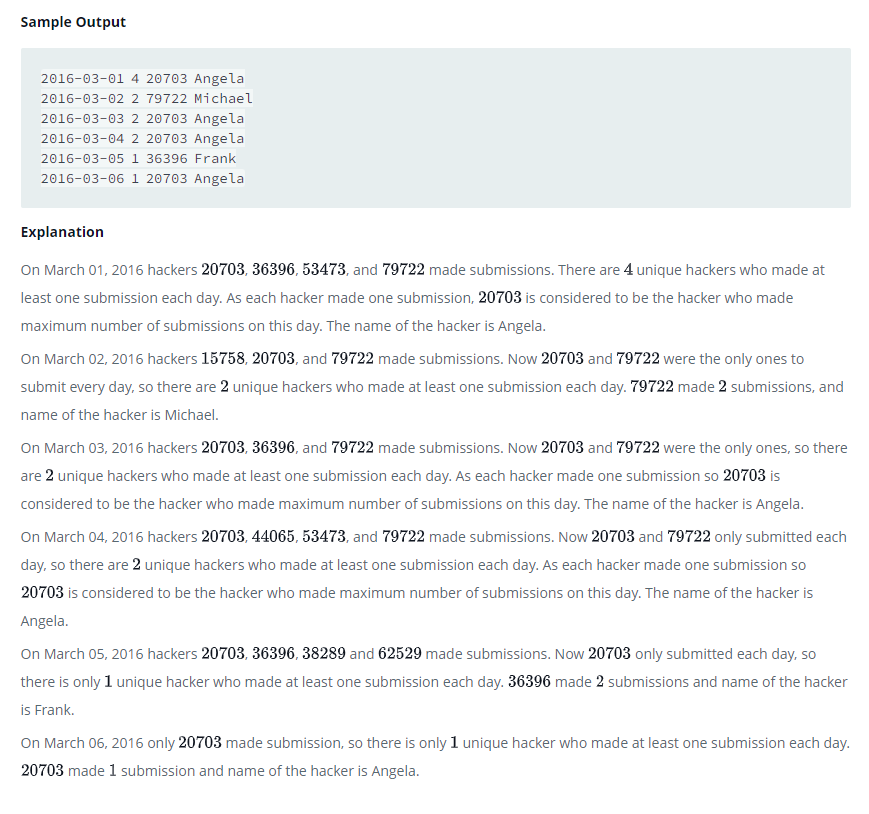

### 



#### eng:
Julia conducted a  days of learning SQL contest. The start date of the contest was March 01, 2016 and the end date was March 15, 2016.

Write a query to print total number of unique hackers who made at least  submission each day (starting on the first 
day of the contest), and find the hacker_id and name of the hacker who made maximum number of submissions each day. 
If more than one such hacker has a maximum number of submissions, print the lowest hacker_id. The query should print 
this information for each day of the contest, sorted by the date.   


#### рус:
Юлия провела конкурс дней обучения SQL. Дата начала конкурса 01.03.2016, дата окончания 15.03.2016.

Напишите запрос для вывода общего количества уникальных хакеров, которые делали как минимум сабмиты каждый день 
(начиная с первого дня конкурса), и найдите hacker_id и имя хакера, который сделал максимальное количество сабмитов 
каждый день. Если более одного такого хакера имеют максимальное количество представлений, выведите наименьший 
hacker_id. Запрос должен вывести эту информацию для каждого дня конкурса, отсортированного по дате.   


#### код с коментариями:
```sql
SELECT 
    b.submission_date, COALESCE(a.contSub,0), b.id, c.name
FROM (
    SELECT o.submission_date, MIN(o.hacker_id) AS id
    FROM (
        SELECT n.submission_date, n.hacker_id,COUNT(n.submission_id)
        FROM Submissions n
        GROUP BY submission_date, hacker_id
        HAVING COUNT(submission_id)>= ALL(
              SELECT COUNT(m.submission_id)
              FROM Submissions m
              GROUP BY m.submission_date, m.hacker_id
              HAVING m.submission_date=n.submission_date
          )
    ) AS o
    GROUP BY submission_date
    ) AS b
LEFT JOIN (
    SELECT aa.submission_date, COUNT(DISTINCT aa.hacker_id) AS contSub
    FROM Submissions AS aa
    WHERE aa.submission_date='2016-03-01' 
    OR submission_date<ALL(
        SELECT bb.submission_date
        FROM (
            SELECT tdy.hacker_id, tdy.submission_date, ytd.submission_date AS SubmittedYtd
            FROM Submissions tdy LEFT JOIN Submissions ytd
            ON DATE_ADD(tdy.submission_date, INTERVAL -1 DAY)= ytd.submission_date 
            AND ytd.hacker_id=tdy.hacker_id    
        ) AS bb
        WHERE aa.hacker_id=bb.hacker_id AND bb.submission_date<> STR_TO_DATE('2016-03-01', '%Y-%m-%d') AND bb.SubmittedYtd IS NULL
    )
    GROUP BY aa.submission_date
) AS a 
ON a.submission_date=b.submission_date
JOIN Hackers c ON b.id=c.hacker_id
ORDER BY a.submission_date ASC
```

#### код для hackerrank:
```sql
SELECT 
    b.submission_date, COALESCE(a.contSub,0), b.id, c.name
FROM (
    SELECT o.submission_date, MIN(o.hacker_id) AS id
    FROM (
        SELECT n.submission_date, n.hacker_id,COUNT(n.submission_id)
        FROM Submissions n
        GROUP BY submission_date, hacker_id
        HAVING COUNT(submission_id)>= ALL(
              SELECT COUNT(m.submission_id)
              FROM Submissions m
              GROUP BY m.submission_date, m.hacker_id
              HAVING m.submission_date=n.submission_date
          )
    ) AS o
    GROUP BY submission_date
    ) AS b
LEFT JOIN (
    SELECT aa.submission_date, COUNT(DISTINCT aa.hacker_id) AS contSub
    FROM Submissions AS aa
    WHERE aa.submission_date='2016-03-01' 
    OR submission_date<ALL(
        SELECT bb.submission_date
        FROM (
            SELECT tdy.hacker_id, tdy.submission_date, ytd.submission_date AS SubmittedYtd
            FROM Submissions tdy LEFT JOIN Submissions ytd
            ON DATE_ADD(tdy.submission_date, INTERVAL -1 DAY)= ytd.submission_date 
            AND ytd.hacker_id=tdy.hacker_id    
        ) AS bb
        WHERE aa.hacker_id=bb.hacker_id AND bb.submission_date<> STR_TO_DATE('2016-03-01', '%Y-%m-%d') AND bb.SubmittedYtd IS NULL
    )
    GROUP BY aa.submission_date
) AS a 
ON a.submission_date=b.submission_date
JOIN Hackers c ON b.id=c.hacker_id
ORDER BY a.submission_date ASC
```


#### На [главную](https://github.com/BEPb/hackerrank_sql#readme)

---