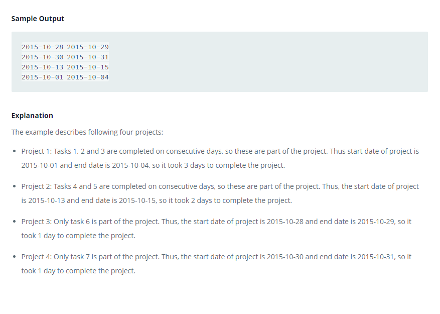

### 



#### eng:
You are given a table, Projects, containing three columns: Task_ID, Start_Date and End_Date. It is guaranteed that the difference between the End_Date and the Start_Date is equal to 1 day for each row in the table.


If the End_Date of the tasks are consecutive, then they are part of the same project. Samantha is interested in finding the total number of different projects completed.

Write a query to output the start and end dates of projects listed by the number of days it took to complete the 
project in ascending order. If there is more than one project that have the same number of completion days, then 
order by the start date of the project.  


#### рус:
Вам дана таблица Projects, содержащая три столбца: Task_ID, Start_Date и End_Date. Гарантируется, что разница между End_Date и Start_Date равна 1 дню для каждой строки в таблице.


Если End_Date задач совпадают, то они являются частью одного и того же проекта. Саманте интересно узнать общее количество завершенных различных проектов.

Напишите запрос для вывода дат начала и окончания проектов, перечисленных по количеству дней, затраченных на 
выполнение проекта, в порядке возрастания. Если имеется более одного проекта с одинаковым количеством дней 
завершения, заказывайте по дате начала проекта.  


#### код с коментариями:
```sql
/* Этот внешний запрос предназначен только для упорядочения по продолжительности проекта */
SELECT
    P3.sd,P3.ed
FROM
    (SELECT
        MIN(P1.Start_Date) AS sd,
        P2.End_Date  AS ed
    FROM Projects AS P1
    INNER JOIN Projects AS P2
    ON  p2.End_Date
        NOT IN (SELECT
                    Start_Date
                FROM Projects)
                /*мы исключаем даты окончания, существующие на Start_Date, что означает, что они являются частью одного и того же проекта*/
    AND
    /*Как только мы нашли дату окончания, не совпадающую с любой из дат начала, мы проверяем в обратном порядке, сколько других столбцов есть
    в течение одного и того же промежутка времени считайте их первыми, если число равно разнице в днях, что означает, что они на самом деле
    связаны. Используйте «группировать по» End_date с MIN(), чтобы найти самую раннюю дату начала, которая связана */
    (SELECT
        COUNT(*)
     FROM Projects
     WHERE Start_Date BETWEEN P1.Start_Date AND P2.End_Date ) = DATEDIFF(P2.End_Date,P1.Start_Date)
    GROUP BY P2.End_Date) AS P3
ORDER by DATEDIFF(P3.ed, P3.sd), P3.sd ;
```

#### код для hackerrank:
```sql
SELECT
    P3.sd,P3.ed
FROM
    (SELECT
        MIN(P1.Start_Date) AS sd,
        P2.End_Date  AS ed
    FROM Projects AS P1
    INNER JOIN Projects AS P2
    ON  p2.End_Date
        NOT IN (SELECT
                    Start_Date
                FROM Projects)
    AND
    (SELECT 
        COUNT(*) 
     FROM Projects  
     WHERE Start_Date BETWEEN P1.Start_Date AND P2.End_Date ) = DATEDIFF(P2.End_Date,P1.Start_Date)
    GROUP BY P2.End_Date) AS P3
ORDER by DATEDIFF(P3.ed, P3.sd), P3.sd ;
```


#### На [главную](https://github.com/BEPb/hackerrank_sql#readme)

---