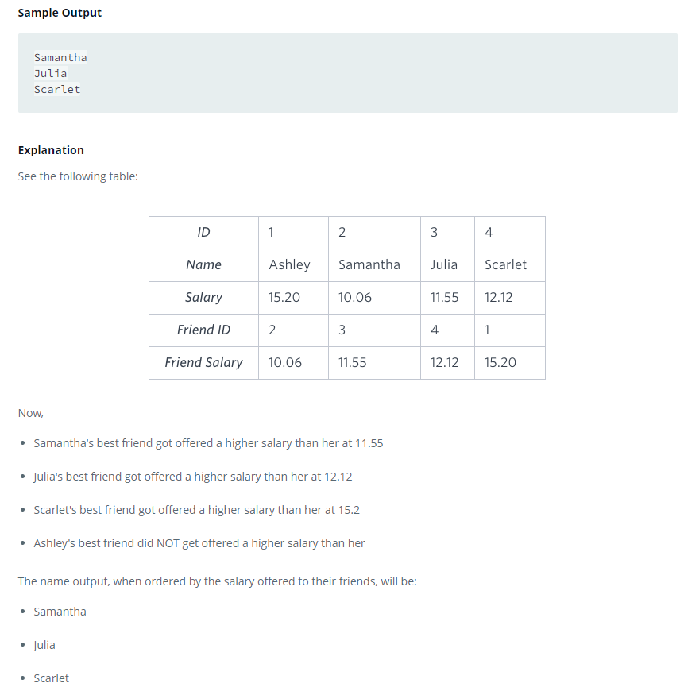

### 



#### eng:
You are given three tables: Students, Friends and Packages. Students contains two columns: ID and Name. Friends contains two columns: ID and Friend_ID (ID of the ONLY best friend). Packages contains two columns: ID and Salary (offered salary in $ thousands per month).


Write a query to output the names of those students whose best friends got offered a higher salary than them. Names 
must be ordered by the salary amount offered to the best friends. It is guaranteed that no two students got same 
salary offer.  


#### рус:
Вам дается три таблицы: Студенты, Друзья и Пакеты. Студенты содержит два столбца: идентификатор и имя. Друзья содержит две колонки: ID и Friend_ID (ID ЕДИНСТВЕННОГО лучшего друга). Пакеты содержат две колонки: ID и Salary (предлагаемая зарплата в тысячах долларов в месяц).


Напишите запрос для вывода имен тех студентов, чьим лучшим друзьям предложили более высокую зарплату, чем они. Имена 
должны быть упорядочены по сумме зарплаты, предлагаемой лучшим друзьям. Гарантируется, что никакие два студента не 
получили одинаковое предложение по зарплате.  


#### код с коментариями:
```sql
SELECT std.name
FROM students std
JOIN friends frnd ON std.id=frnd.id
JOIN packages std_pkg ON std.id=std_pkg.id
JOIN packages frnd_pkg ON frnd.friend_id=frnd_pkg.id
WHERE frnd_pkg.salary > std_pkg.salary
ORDER BY frnd_pkg.salary;
```

#### код для hackerrank:
```sql
SELECT std.name
FROM students std
JOIN friends frnd ON std.id=frnd.id
JOIN packages std_pkg ON std.id=std_pkg.id
JOIN packages frnd_pkg ON frnd.friend_id=frnd_pkg.id
WHERE frnd_pkg.salary > std_pkg.salary
ORDER BY frnd_pkg.salary;
```


#### На [главную](https://github.com/BEPb/hackerrank_sql#readme)

---