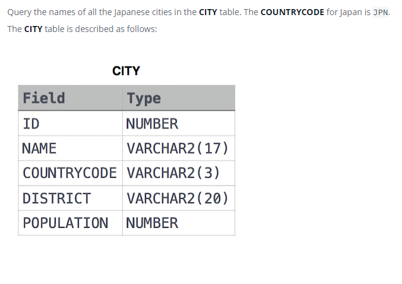

### Названия японских городов [Japanese Cities' Names]



#### eng:
Query the names of all the Japanese cities in the CITY table. The COUNTRYCODE for Japan is JPN.
The CITY table is described as follows:


#### рус:
Запросите названия всех японских городов в таблице CITY. КОД СТРАНЫ для Японии — JPN.
Таблица CITY описывается следующим образом:


#### код с пояснениями:
```sql
SELECT NAME                 /* выбрать данные столбца */
FROM CITY                   /* из таблицы */
WHERE COUNTRYCODE = 'JPN'   /* где условие */
```

#### код для hackerrank:
```sql
SELECT NAME FROM CITY WHERE COUNTRYCODE = 'JPN'
```


#### На [главную](https://github.com/BEPb/hackerrank_sql#readme)

---