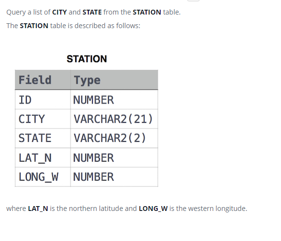

### Станция наблюдения за погодой 1 [Weather Observation Station 1]



#### eng:
Query a list of CITY and STATE from the STATION table.
The STATION table is described as follows:

where LAT_N is the northern latitude and LONG_W is the western longitude.


#### рус:
Запросите список CITY и STATE из таблицы STATION.
Таблица STATION описывается следующим образом:

где LAT_N — северная широта, а LONG_W — западная долгота.


#### код с пояснениями:
```sql
SELECT          /* выбрать данные */
    CITY,       /* столбец */
    STATE       /* столбец */
FROM STATION    /* из таблицы */
```

#### код для hackerrank:
```sql
SELECT CITY, STATE FROM STATION 
```


#### На [главную](https://github.com/BEPb/hackerrank_sql#readme)

---