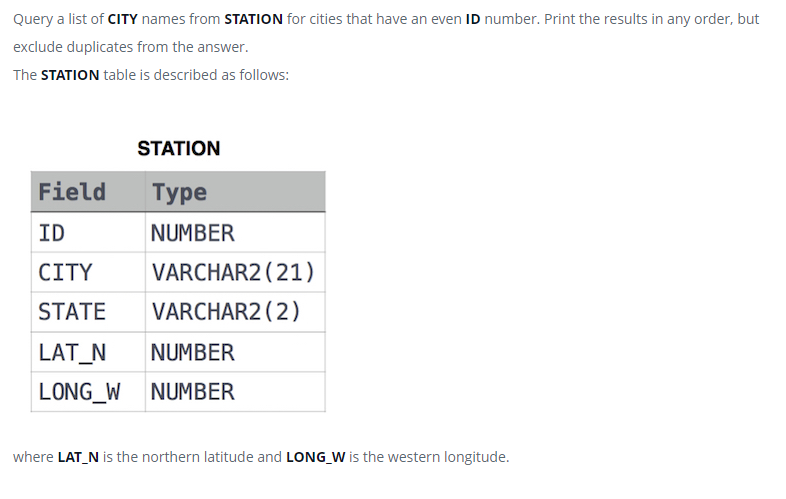

### Станция наблюдения за погодой 3 [Weather Observation Station 3]



#### eng:
Query a list of CITY names from STATION for cities that have an even ID number. Print the results in any order, but exclude duplicates from the answer.
The STATION table is described as follows:
where LAT_N is the northern latitude and LONG_W is the western longitude.


#### рус:
Запросите список названий ГОРОДА из STATION для городов с четным идентификационным номером. Выведите результаты в 
любом порядке, но исключите дубликаты из ответа.
Таблица STATION описывается следующим образом:
где LAT_N — северная широта, а LONG_W — западная долгота.


#### код с пояснениями:
```sql
SELECT DISTINCT CITY /* выбрать уникальные значения столбца */
FROM STATION         /* из таблицы */
WHERE MOD(ID,2)=0    /* где модуль деления на 2 столбца = 0 */
```

#### код для hackerrank
```sql
SELECT DISTINCT CITY FROM STATION
WHERE MOD(ID,2)=0
```

```SQL
SELECT DISTINCT CITY FROM STATION
WHERE ID%2=0
```


#### На [главную](https://github.com/BEPb/hackerrank_sql#readme)

---