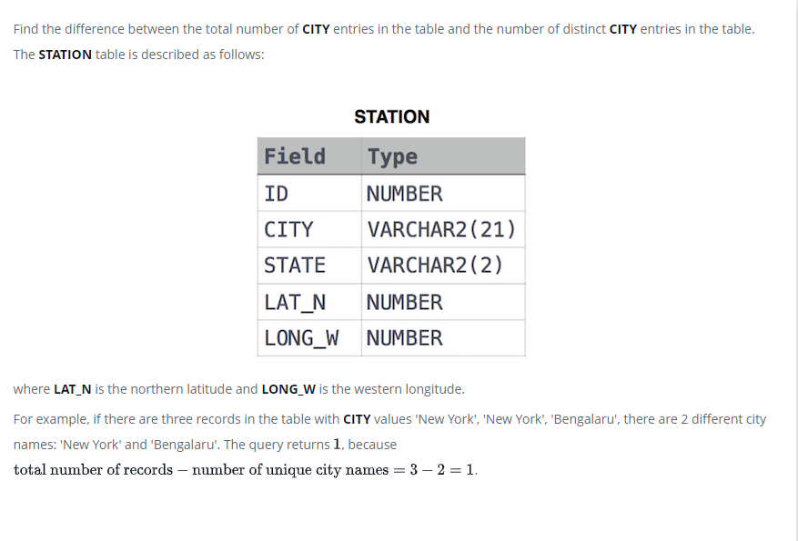

### Станция наблюдения за погодой 4 [Weather Observation Station 4]



#### eng:
Find the difference between the total number of CITY entries in the table and the number of distinct CITY entries in 
the table.
The STATION table is described as follows:

where LAT_N is the northern latitude and LONG_W is the western longitude.
For example, if there are three records in the table with CITY values 'New York', 'New York', 'Bengalaru', there are 
2 different city names: 'New York' and 'Bengalaru'. The query returns , because .


#### рус:
Найдите разницу между общим количеством записей CITY в таблице и количеством отдельных записей CITY в таблице.
Таблица STATION описывается следующим образом:

где LAT_N — северная широта, а LONG_W — западная долгота.

Например, если в таблице есть три записи со значениями ГОРОД «Нью-Йорк», «Нью-Йорк», «Бенгалару», есть 2 разных названия
города: «Нью-Йорк» и «Бенгалару». Запрос возвращает , потому что .


#### код с пояснениями:
```sql
SELECT              /* выбрать данные */
    -- количество (столбца) минус количество (уникальных значений)
    COUNT(CITY) - COUNT(DISTINCT CITY)  /* столбец разницы */
FROM STATION        /* из таблицы */
```

#### код для hackerrank
```sql
SELECT COUNT(CITY)- COUNT(DISTINCT CITY) FROM STATION
```


#### На [главную](https://github.com/BEPb/hackerrank_sql#readme)

---